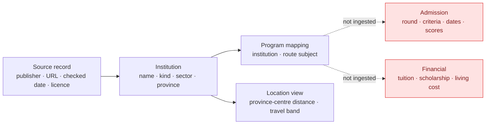

# Data coverage and governance

[← Source Review](09-source-review.md) · [Back to README](../READMEEN.md)

> **Release 0.2.0 · checked 11 August 2026.** This document describes data that is actually stored
> and used. It does not turn an official portal into an ingested dataset or a directory into a
> recommendation.

## One contract for data status

[`data/education-data-registry.json`](../data/education-data-registry.json) is the machine-readable
contract for Institution, Program, Admission, Financial and Location data. It records coverage,
available fields, known gaps, sources, check dates, licences and the exact way each domain may be
used. [`data/release.json`](../data/release.json) ties that contract to release 0.2.0.

| Domain | Coverage in 0.2.0 | Status | May affect route selection? |
|---|---:|---|:---:|
| Institution | 1,417 source records; 1,375 unique institutions shown | Partially verified directory | No |
| Program | 140 shown institutions have programme-derived route mappings | Partial degree-level mapping | No |
| Admission | 0 local records | Unavailable | No |
| Financial | 0 local records | Unavailable | No |
| Location | 77 provinces; 1,961 display rows | Partially verified from province centres | No |

Programme mappings only narrow a directory result where the official degree source covers the
institution. An absent mapping means **not covered**, never “teaches nothing.” Vocational providers
therefore keep a clearly documented institution-type fallback.

## Data model



The dotted edges are future relationships, not hidden data. Admission and financial fields remain
empty until a source is ingested at programme, campus and academic-year level.

## Decision boundary

The route engine currently uses:

- interest profile;
- mission evidence;
- learning-environment affinity derived from the same interest profile; and
- education-tier eligibility.

It does not use institution, programme, TCAS, fee, scholarship, accommodation, cost-of-living or
distance data. The education directory helps a learner investigate a route after selection; it
does not choose the route.

## Validation rules

`npm run check:data` fails when:

- repository, package, component or registry versions disagree;
- a source-backed domain has no checked HTTPS source;
- an unavailable domain claims local records or decision use;
- coverage counts disagree with the source and web datasets;
- a route field marked unverified is missing from the decision hold-out list;
- identifiers, province links, coordinates, outcomes, checksums or programme-route mappings break.

Unknown values are expected. The validator reports them and preserves `null` or absence instead of
filling them with estimates.

## Adding dynamic data safely

For TCAS, fees, scholarships or other changing fields, one record needs at least:

```text
institution_id · campus_id · programme_id · academic_year · field name · value
source URL · publisher · retrieved_at · valid_until · status
```

The source must be authoritative and its reuse terms must be recorded. A new field remains outside
scoring until its source, scope, freshness behavior, missing-data behavior, UI disclosure and
regression tests are reviewed together.

---

[← Source Review](09-source-review.md) · [Back to README](../READMEEN.md)
