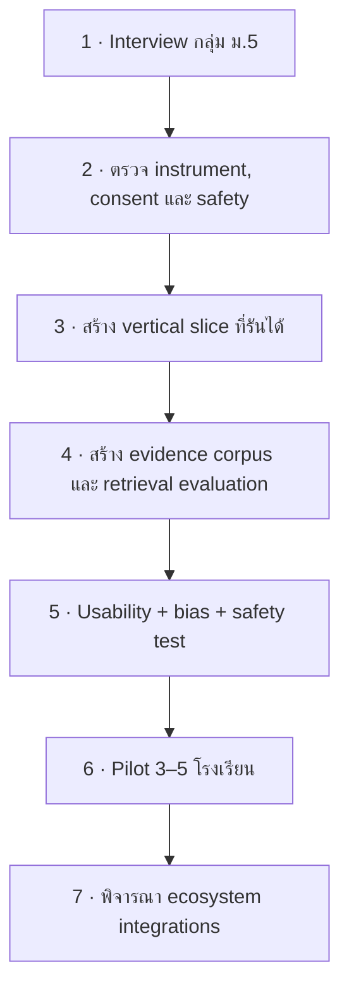

# Development Plan

> **สถานะ:** `reconciled plan` — สถานะด้านล่างอ้างเฉพาะสิ่งที่มี artifact อยู่ในคลังรวม ไม่ใช้เปอร์เซ็นต์ความคืบหน้าจากเอกสารเดิม

[← Architecture](../06_System_Architecture/02_FutureMe_System_Architecture.md) · [Back to README](../README.md) · [Next: Roadmap →](04_Product_Roadmap.md)

## สิ่งที่มีหลักฐานอยู่ในคลัง

| งาน | หลักฐานที่พบ | สถานะ |
|---|---|---|
| Research base และ source audit | เอกสาร Data, references, metadata และ audit log | `documented` |
| Product concept และ user journey | product/UX docs, Aurora direction และ mockup 6 หน้าจอ | `designed` |
| Decision architecture | RIASEC/STAR/mission concept, matrix weights และ route definitions | `specified; unvalidated` |
| Thai AI/RAG engineering research | คู่มือ 00–17, diagrams และ Python examples | `technical_reference` |
| System architecture | master flow, subsystem diagrams และ API contract draft | `target_architecture` |
| Business/pilot plan | beachhead, B2B2C hypothesis, interview plan และ targets | `planned` |

## สิ่งที่เอกสารเดิมอ้าง แต่ตรวจจากแพ็กเกจนี้ไม่ได้

- product backend และ frontend
- `app/decision_engine/*` และ `app/rag/*`
- FastAPI endpoints ที่รันได้
- Pydantic schemas ของผลิตภัณฑ์
- Qdrant collection และ full corpus
- verification agent หรือ automated audit suite
- QLoRA training/test dataset ที่เอกสารกล่าวถึง
- AIS Open API integration
- NDLP/DEEP integration
- AIS Cloud deployment

รายการเหล่านี้จึงใช้สถานะ `unverified implementation status` จนกว่าเจ้าของงานจะนำโค้ด ผลทดสอบ หรือ deployment artifact เข้ามา

## ลำดับพัฒนาที่แนะนำ

### 1. Discovery

เริ่มจากนักเรียน ม.5 โรงเรียนรัฐนอกเมืองใหญ่ตาม beachhead ที่ตกลงไว้ สัมภาษณ์นักเรียน ครูแนะแนว และผู้ปกครองก่อนยืนยัน problem statement, payer และ workflow

### 2. Instrument และ safety review

ให้ผู้เชี่ยวชาญตรวจ RIASEC items, STAR prompts และ mission rubrics พร้อมกำหนด consent, safeguarding, data retention และสิทธิ์การเข้าถึงสำหรับผู้เยาว์

### 3. Vertical slice

ทำเส้นทางเดียวให้จบตั้งแต่ guest session → Socratic interview → mission หนึ่งแบบ → สาม route → prerequisite roadmap → แผน 30 วัน โดยยังไม่พึ่ง NDLP, DEEP หรือ AIS APIs

### 4. Evidence และ RAG

สร้าง corpus ที่มี source metadata และสถานะ claim จริง แยก evidence index จาก design/pitch index ทดสอบ retrieval, citation, refusal และ stale-data handling

### 5. Validation

ทดสอบ usability, accessibility, bias, hallucination, prompt injection, privacy leakage และการตีความคำแนะนำผิดว่าเป็นคำทำนาย

### 6. School pilot

ใช้แผนใน `../07_Business_and_Competition/02_Pilot_and_Metrics.md` เก็บ baseline, หลังใช้งาน และ follow-up โดยไม่รายงาน target เป็น outcome

### 7. Ecosystem

ประเมิน NDLP, DEEP, AIS Open APIs และ AIS Cloud หลังได้รับเอกสารทางเทคนิค สิทธิ์เข้าถึง และข้อตกลงที่จำเป็นแล้ว

## Definition of done สำหรับ Prototype

- มี repository และคำสั่งรันที่ทำซ้ำได้
- test ครอบคลุม rule engine, schema, retrieval และสิทธิ์เข้าถึง
- ทุก route อธิบายเหตุผล หลักฐาน สิ่งที่ยังไม่รู้ และขั้นตอนที่ย้อนกลับได้
- ไม่มี claim จาก quarantine หลุดเข้า output
- raw transcript ไม่ถูกแชร์โดยปริยาย
- dependency graph บังคับลำดับเฉพาะ prerequisite ส่วนผู้ใช้เปลี่ยนเส้นทางได้
- มีการระบุชัดว่าเป็นเครื่องมือสำรวจ ไม่ใช่ผลวินิจฉัยหรือการรับประกันเรียนต่อ/มีงานทำ

ถ้าเวลาน้อย ให้ตัด animation และจำนวนหน้าจอก่อนตัด transparency, consent, safety หรือ accessibility

