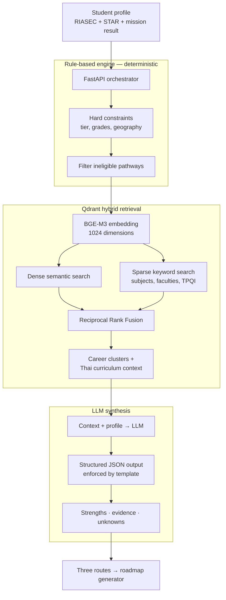
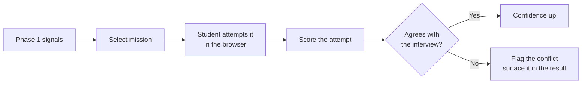
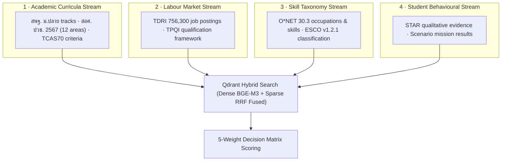

# 04 · AI System

> **สถานะ:** `design_assumption` — เอกสารนี้อธิบาย target behaviour และ API design ไม่ใช่หลักฐานว่า product backend ถูก implement แล้ว

[← User Experience](../04_Product_and_UX/02_User_Experience.md) · [Back to README](../README.md) · [Next: Architecture →](../06_System_Architecture/02_FutureMe_System_Architecture.md)

---

## The governing principle: do not let the LLM decide

This came directly from advisor review and it shapes everything below. The system is split so
that **rules decide and the model communicates**.

| | Rule-based engine | LLM |
|---|---|---|
| RIASEC scoring | ● | — |
| Eligibility and hard constraints | ● | — |
| Decision-matrix weighting | ● | — |
| Route selection | ● | — |
| Conducting the interview | — | ● |
| Extracting STAR structure from free text | — | ● |
| Writing the explanation | — | ● |

**Why.** A recommendation that changes between runs cannot be defended to a student, a parent or
a counsellor. Deterministic scoring means the same evidence always produces the same routes, and
every number is traceable to a line of code. The model handles what it is genuinely better at:
conversation and explanation.

The second reason is cost. A small, Thai-capable model plus retrieval plus a LoRA adapter is
cheaper and faster than a large general model, and the retrieval corpus is where the actual
domain knowledge lives.

---

## Pipeline

---

## Phase 1 — Socratic interview

An adaptive conversation, 5–10 minutes, tone and vocabulary adjusted per education tier.

**Two things run in parallel:**

**RIASEC scoring.** A 30-item instrument, 5 items per dimension, 1–5 Likert. Produces raw
scores, normalised scores, a three-letter Holland code (e.g. `RIA`) and a percentage breakdown.
Target module: `app/decision_engine/riasec.py` — path นี้มาจาก design document แต่ไม่มีไฟล์ดังกล่าวใน Handover

**STAR extraction.** 5–8 qualitative questions evaluated for Situation → Task → Action → Result
structure. Answers grounded in something the student actually did score higher than opinions;
Socratic follow-ups probe where the structure is incomplete. Yields strengths and
learning-style signals. Target module: `app/decision_engine/star_eval.py` — implementation
not present in this repository.

Laddering pushes from stated behaviour toward underlying values; Motivational Interviewing keeps
the tone non-judgemental so the student is not defending a position.

---

## Phase 2 — Scenario mission

A short hands-on task, 3–5 minutes, chosen in the direction Phase 1 pointed toward.

This is what separates the product from a questionnaire. A student who *says* they like design
gets a small design problem; the result is independent evidence. **A contradiction is not
discarded — it is shown to the student** as something worth investigating.

Mission concepts are documented for AI/software exploration, the 12 ปวช. vocational areas,
DVE, and TCAS/TPAT planning. The interactive mission implementation is not present here.

---

## The decision matrix

Five criteria, each scored 0–100, combined into one weighted composite.

| Criterion | Weight | Fed by |
|---|---:|---|
| Interests | 30% | RIASEC profile |
| Feasibility | 25% | GPA readiness, financial access, geographic access |
| Strengths | 20% | STAR evidence and mission result |
| Learning style | 15% | Extracted preferences |
| Future flexibility | 10% | Cross-industry versatility, further-study openness |

**Feasibility at 25% is a deliberate choice.** A recommendation a student cannot afford, cannot
reach, or cannot academically qualify for is not a recommendation. Weighting it second-highest
keeps the output honest about constraints that guidance advice usually ignores.

> These weights are **set by design judgement, not fitted to outcome data.** No student outcome
> data exists yet. Calibrating them against real results is a roadmap item.

Target module: `app/decision_engine/matrix.py` — implementation not present in this repository.

---

## Multi-tier routing

The same engine serves four education tiers with different pathway sets.

| Tier | Grades | Pathways considered |
|---|---|---|
| `PRIMARY` | ป.4 – ป.6 | Play-based interest discovery, career awareness |
| `LOWER_SECONDARY` | ม.1 – ม.3 | 5 ม.4 tracks, 12 ปวช. areas, DVE, plus a counsellor safety route |
| `UPPER_SECONDARY` | ม.4 – ม.6 | Faculty matching, TCAS context, TPAT1–5 mapping, portfolio |
| `VOCATIONAL` | ปวช. – ปวส. | ปวส. progression, bachelor's technology track, direct employment |

The **safety route** at lower secondary is worth noting: when a student's confidence or grades
are uncertain, the engine returns a parallel fallback spanning both general and vocational
options, explicitly flagged for a counsellor conversation rather than an autonomous decision.

Target module: `app/decision_engine/multi_tier.py` — implementation not present in this repository.

---

## Retrieval & 4 Data Streams RAG Integration

The target retrieval design combines four data streams. The present repository contains
reviewed summaries and seed mappings, not a full production corpus or Qdrant collection:

| Component | Choice | Reason |
|---|---|---|
| Embedding | BAAI/BGE-M3, 1024-dim | Strong multilingual and Thai performance |
| Vector store | Qdrant | Hybrid dense + sparse in one query |
| Retrieval | Dense semantic + sparse keyword, fused with RRF | Thai queries mix semantic intent with exact terms — faculty names, TPAT codes, TPQI qualifications, which pure vector search retrieves poorly |
| Corpus | 4 Data Streams: Curricula, Labour Market, Skill Taxonomy, Student Evidence | Domain knowledge lives here, not in model weights |

The design document mentions a deterministic hash-based embedding fallback, but its product
implementation is not included. The Python code in `../08_Examples` demonstrates a separate
learning workflow and must not be treated as this backend.

Target modules named in the source draft: `app/rag/pipeline.py` and
`app/rag/qdrant_client.py` — neither is present here.

---

## Generation

The LLM receives retrieved context plus the scored profile and returns **structured JSON under a
prompt template** — not free prose. Every generated route must carry:

- the reasons it was suggested
- the specific evidence supporting each reason
- **what the system is still unsure about**

That third field is required, not optional. A recommendation engine that never expresses
uncertainty is either lying or overfitted, and for a decision this consequential it needs to
say what it does not know.

**Model strategy:** a Thai-capable LLM API (Claude / Typhoon class) for live conversation, with
a small local model plus QLoRA adapter evaluated as a lower-cost alternative for the interview
turn. Both routes are documented; neither is locked in.

---

## What is not working yet

Stated plainly, because a demo can hide all of this:

- **The QLoRA dataset is not usable.** Train and test files are identical, ten examples each. No fine-tune has been evaluated and no evaluation numbers exist.
- **No independent evaluation set.** There is no held-out benchmark for recommendation quality, so "accuracy" cannot be claimed in any form.
- **The RIASEC instrument is unvalidated.** 30 items written from the Holland framework, not psychometrically validated by qualified experts.
- **Mission rubrics are unvalidated** by the same standard.
- **The embedding fallback is active** wherever BGE-M3 weights are absent.
- **No bias audit** across gender, region, school size or socioeconomic status has been run.
- **Product implementation is unverified.** No `app/`, frontend, product tests or deployment
  artifacts are included in this handover.

Each is tracked in [07 · Roadmap](../04_Product_and_UX/04_Product_Roadmap.md).

---

[← User Experience](../04_Product_and_UX/02_User_Experience.md) · [Back to README](../README.md) · [Next: Architecture →](../06_System_Architecture/02_FutureMe_System_Architecture.md)
