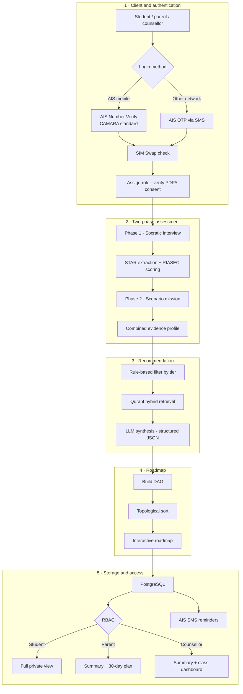
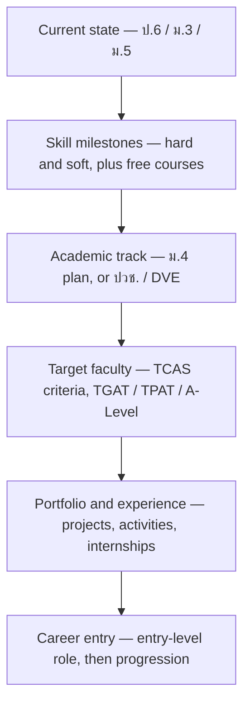
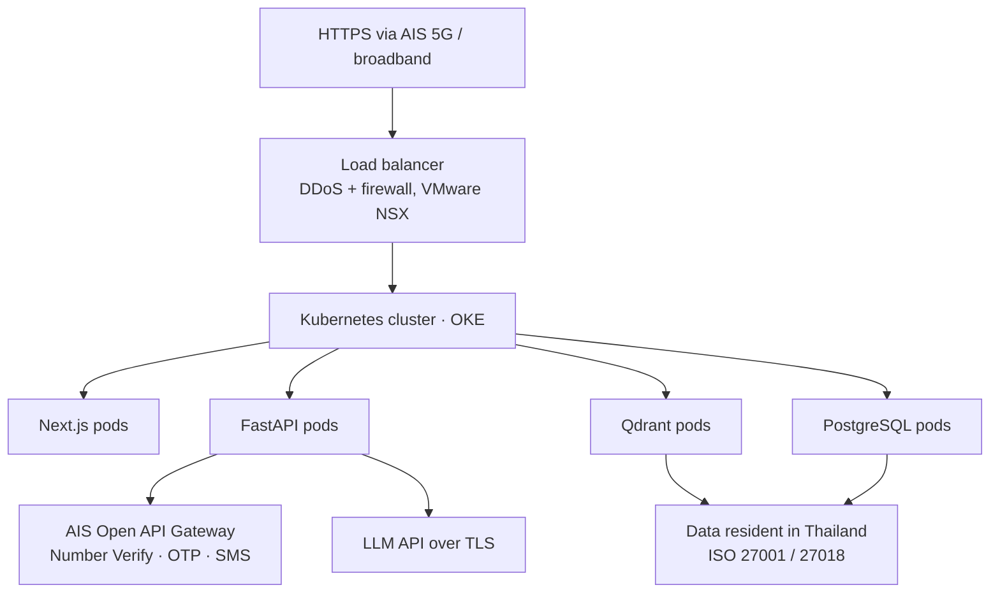
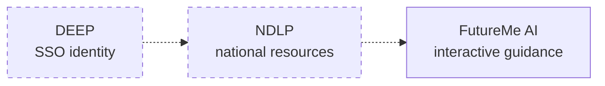

# 05 · System Architecture

> **สถานะ:** `target_architecture` — component, API และ deployment ในเอกสารนี้เป็นข้อเสนอ จนกว่าจะมีโค้ด integration test และ deployment artifact

[← AI System](../05_AI_Engineering/01_FutureMe_AI_Design.md) · [Back to README](../README.md) · [Next: Development Plan →](../04_Product_and_UX/03_Development_Plan.md)

---

## End-to-end flow

---

## Technology stack

| Layer | Choice | Why |
|---|---|---|
| Frontend | Next.js | SSR for first-load speed on mobile networks; strong interactive-graph ecosystem |
| Backend | FastAPI (Python) | Pydantic validation end to end; same language as the ML tooling |
| Vector DB | Qdrant | Native hybrid dense + sparse search |
| Relational DB | PostgreSQL | Profiles, roadmaps, consent records, audit trail |
| Embeddings | BAAI/BGE-M3, 1024-dim | Multilingual, strong on Thai |
| LLM | Thai-capable API (Claude / Typhoon class) | Conversation and explanation only |
| Fine-tuning | QLoRA adapter | Low-cost Thai tone adaptation *(dataset not yet usable)* |
| Containers | Docker → Kubernetes (OKE) | Auto-scaling for classroom bursts |
| Cloud | AIS Cloud powered by OCI | Thai data residency *(target, not deployed)* |
| Identity | AIS Open APIs — Number Verify, OTP, SIM Swap | Passwordless, age-appropriate, takeover-resistant |

---

## The roadmap generator

Hard prerequisites become a **Directed Acyclic Graph**, then a topological sort orders only
those dependencies. The wider exploration graph must allow students to revise goals, revisit
nodes and branch to another route.

In the target design, the prerequisite subgraph is checked for cycles and serialised to JSON.
Progress, reflection and alternative-route edges live outside that DAG so the experience does
not force a false one-way journey.

**Why a prerequisite DAG rather than a list:** prerequisites are partial, not linear. A student
can build a portfolio while preparing for TPAT. But the product as a whole is not a DAG because
students must be able to change direction.

→ Modelled on the roadmap.sh interaction pattern, adapted to Thai education milestones.

---

## Privacy and PDPA

Privacy is an architectural constraint here, not a policy page. The users are minors.

**What is enforced in the design**

- **Raw chat transcripts are private by default.** Any disclosure or safeguarding exception
  needs an explicit policy, legal basis, audit trail and age-appropriate notice.
- **Consent is per-recipient**, visible in the UI, and revocable.
- **Parent access requires a verified relationship**; counsellor access requires the student to be on that counsellor's roster.
- **Guest mode** allows a full session with no account and no persistent identity.
- **Data minimisation** — collect what the recommendation needs, nothing more.
- **Retention limits and an audit trail** on every access to a student record.

**What the cloud provides, and what it does not**

AIS Cloud offers in-country data residency and ISO 27001 / ISO 27018 certification. That covers
where data lives and how the facility is run. It does **not** deliver PDPA compliance on its own:
consent management, access control, minimisation, retention and processor governance are
application-layer responsibilities. This distinction is stated in the research and repeated here
because conflating the two is the most common way a project like this gets compliance wrong.

**Additional protections planned but not implemented:** field-level encryption of sensitive
attributes, automated retention enforcement, and a documented data-subject-request process.

---

## Deployment target

**Scaling assumption:** load is bursty and predictable — a counsellor runs a session with a whole
class at once. Container auto-scaling suits that pattern better than fixed provisioning.

> **Status.** This is a designed target derived from published AIS Cloud specifications. Nothing
> is currently deployed to AIS Cloud, and no capacity or latency figures have been measured.

---

## API surface

| Method | Endpoint | Purpose |
|---|---|---|
| `POST` | `/v1/missions/recommend` | Education level and interests → recommended exploration missions |
| `POST` | `/v1/missions/{id}/submissions` | Mission answers → evaluation and adaptive follow-up questions |
| `POST` | `/v1/future-paths` | Full student profile → three route alternatives with matrix breakdown |
| `GET` | `/v1/future-paths/{id}` | Retrieve a stored evaluation and route detail |

These endpoints and Pydantic schemas are a target contract. Product code is not included in the
Handover, so validation behaviour and in-memory persistence cannot be confirmed from this
repository.

---

## Ministry ecosystem integration

Dashed lines are deliberate. Integrating with DEEP identity or NDLP content could reduce
duplicate infrastructure, but current SSO/API availability, content licensing and the presence
or behaviour of an NDLP RIASEC module are unverified.

**But no agreement exists.** This depends on official API documentation, technical access
approval, and a formal partnership — none of which are in place. It is a roadmap item and should
be presented as nothing more.

---

[← AI System](../05_AI_Engineering/01_FutureMe_AI_Design.md) · [Back to README](../README.md) · [Next: Development Plan →](../04_Product_and_UX/03_Development_Plan.md)
