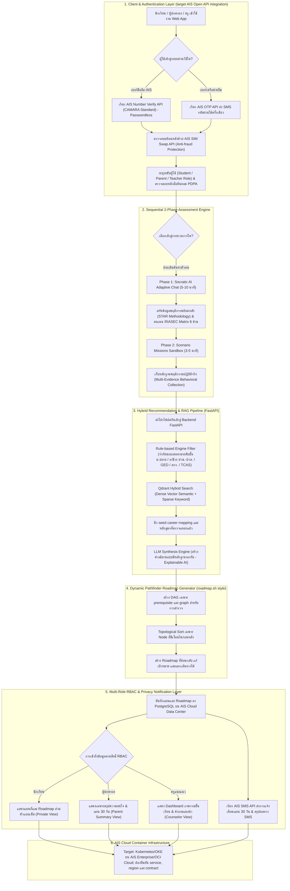
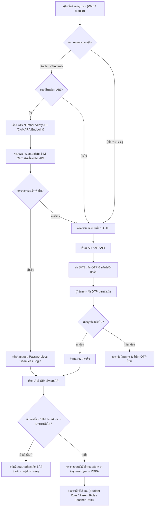
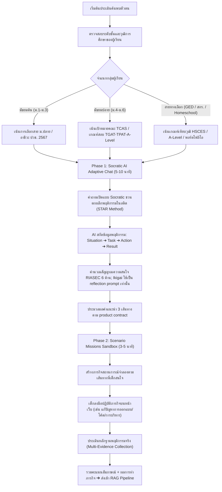
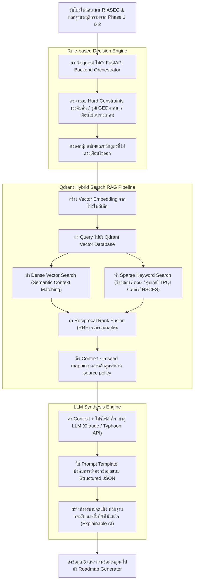
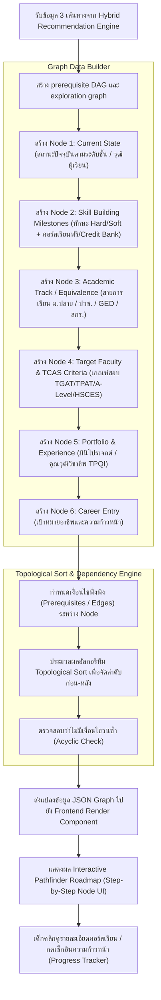
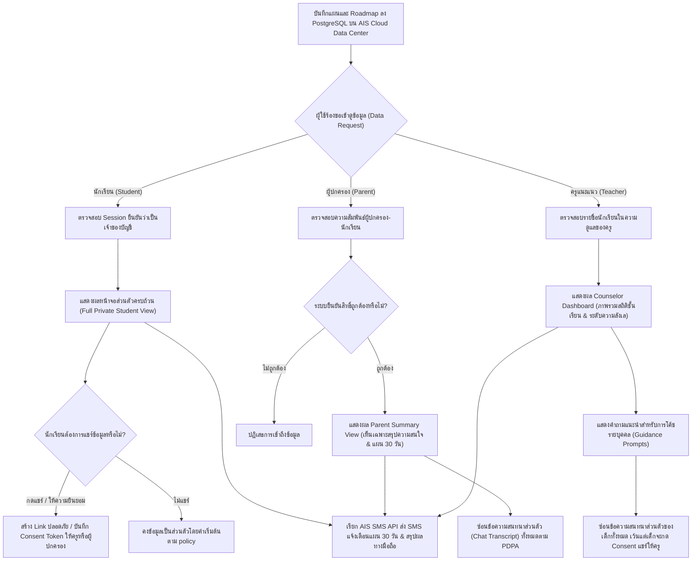
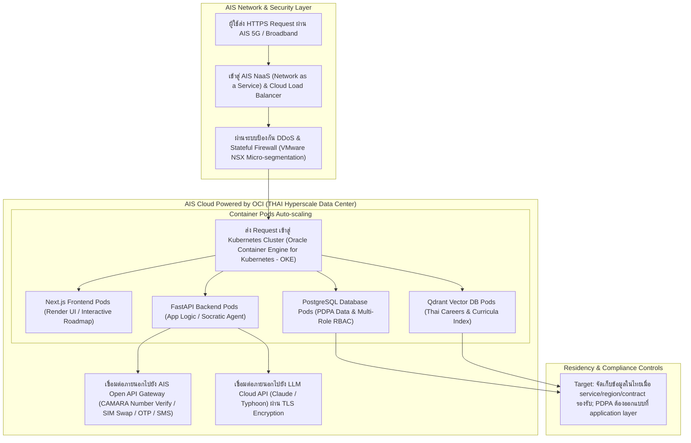

# คลังผังกระบวนการทำงานระบบ FutureMe AI (Detailed System Flowcharts Master Catalog)

> **เวทีการแข่งขัน:** JUMP THAILAND Hackathon 2026 (AIS Academy x NIA)  
> **สถานะเอกสาร:** `target_architecture` — ผังนี้สังเคราะห์จากหลักฐานและเอกสารออกแบบ แต่ยังไม่ยืนยันว่า component, API หรือ deployment ทำงานแล้ว ดูข้อจำกัดใน [Source Policy](../00_Governance/SOURCE_POLICY.md)

---

## 1. ผังกระบวนการทำงานภาพรวมทั้งระบบ (Master System Operations Flowchart)

---

## 2. ผังแยกรายระบบย่อย (Detailed Sub-system Flowcharts)

### ระบบย่อยที่ 1: ระบบยืนยันตัวตนและการจัดการสิทธิ์ (IAM & AIS Open API Authentication Flowchart)

---

### ระบบย่อยที่ 2: ระบบประเมิน 2 เฟสและการโค้ชด้วย AI (Sequential 2-Phase Assessment Flowchart)

---

### ระบบย่อยที่ 3: ระบบวิเคราะห์และดึงข้อมูลอัจฉริยะ (Hybrid Recommendation & RAG Pipeline Flowchart)

---

### ระบบย่อยที่ 4: ระบบสร้างแผนที่เส้นทางแบบโต้ตอบ (Dynamic Pathfinder Roadmap Generator Flowchart)

---

### ระบบย่อยที่ 5: ระบบแดชบอร์ดสิทธิ์และการคุ้มครองข้อมูลส่วนบุคคล (Multi-Role RBAC & PDPA Dashboard Flowchart)

---

### ระบบย่อยที่ 6: โครงสร้างพื้นฐานและการติดตั้งบน AIS Cloud (AIS Cloud Container Deployment Flowchart)

---

## 3. การสรุปคุณค่าและการนำไปใช้งานในวันแข่ง Hackathon

ผังนี้ใช้สื่อสารขอบเขต **target architecture** ในวัน Demo Day ยังไม่ผ่าน production-readiness review และไม่ใช่หลักฐานว่า deploy แล้ว:
1. **แสดงภาพรวมความเข้าใจเชิงระบบ (Master Operations Flowchart):** ชี้ให้เห็นว่าระบบเชื่อมโยงตั้งแต่ AIS OTP/Number Verify ➔ Socratic AI ➔ Qdrant RAG ➔ Dynamic Roadmap ➔ SMS Notification
2. **แสดงรายละเอียดที่ทีมต้องพัฒนา (Sub-system Flowcharts):** ครอบคลุม 6 ระบบ พร้อมจุดที่ต้องทดสอบเรื่อง API, residency, privacy, retrieval และ prerequisite graph
