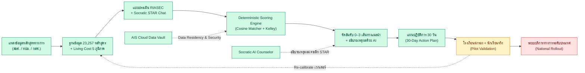
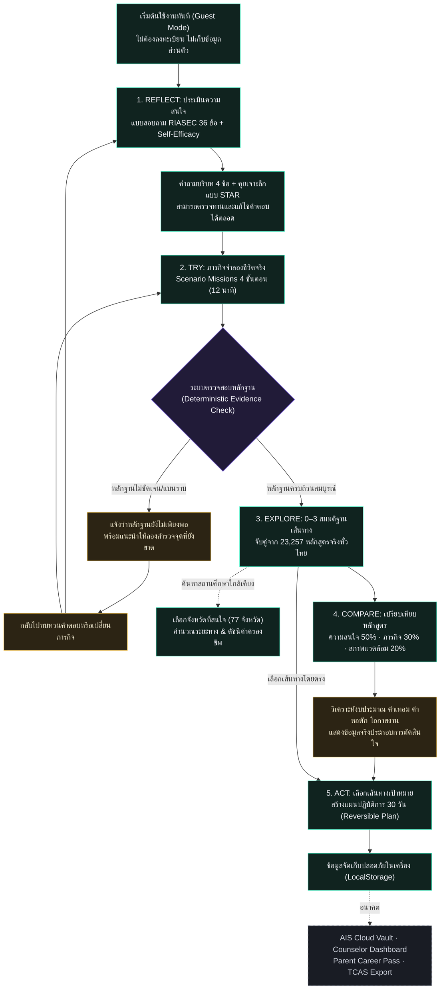
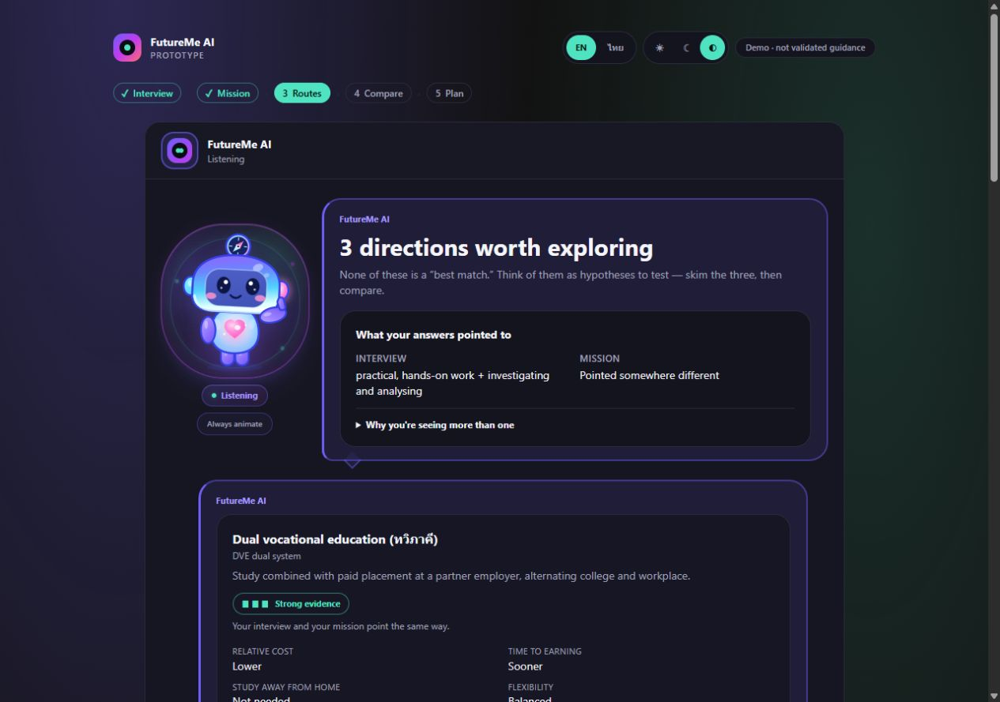
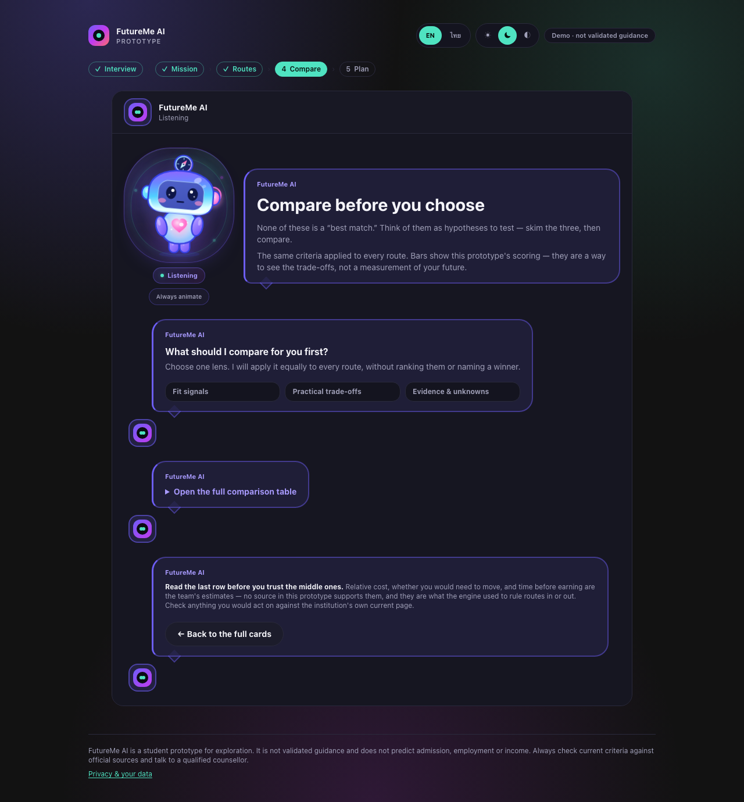
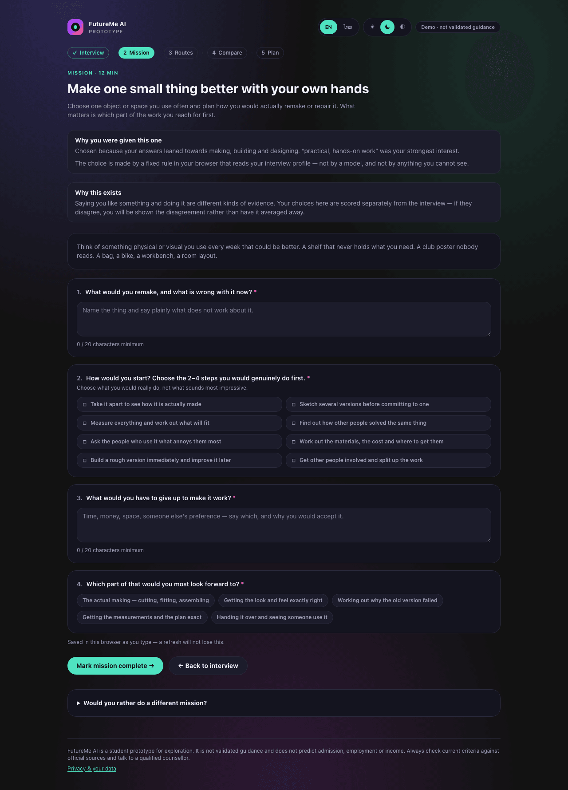

<a id="top"></a>

<p align="center">
  <strong>README:</strong> <strong>[ภาษาไทย (TH)](README.md)</strong> · <a href="README_EN.md">English (EN)</a>
</p>

<p align="center">
  
</p>

# FutureMe AI — ระบบแนะแนวการศึกษาและเส้นทางอาชีพสำหรับเด็กไทย

> **ผลงานเข้าประกวด:** JUMP THAILAND Innovation Hackathon 2026 (AIS Academy x NIA)  
> **Core Concept:** *“ลองเส้นทางอนาคต ก่อนตัดสินใจจริง”* — ระบบประเมินและทดลองเส้นทางอาชีพด้วยหลักฐานจริง (Evidence-Based Guidance)  
> **Core Philosophy:** **“Rules decide. AI explains.”** — ใช้เอนจินคณิตศาสตร์ที่โปร่งใสในการตัดสินใจ และใช้ AI ทำหน้าที่สัมภาษณ์และอธิบายเหตุผล

---

## 🌟 เอกสารสำคัญสำหรับกรรมการ (Submission Quick Links)

| เอกสารนำเสนอ | คำอธิบาย | ไฟล์ดาวน์โหลด / เข้าชม |
|---|---|:---:|
| **Official Pitch Deck (PDF)** | สไลด์นำเสนอฉบับทางการ 7 หน้า (16:9 Widescreen) สำหรับกรรมการ | [📄 `FutureMe_Presentation.pdf`](FutureMe_Presentation.pdf) |
| **Team Portfolio & Evidence** | เอกสารหลักฐานผลงานและความพร้อมของทีม 8 หน้า (หลักฐาน Prototype + ประวัติทีม 5 คน) | [📄 `FutureMe_Team_Portfolio.pdf`](FutureMe_Team_Portfolio.pdf) |
| **Interactive Web App** | แอปพลิเคชัน Next.js 15.5 รันจริงพร้อม 11 หน้าจอ | [🚀 ดูวิธีเปิดแอปด้านล่าง](#-quick-start--วิธีรันแอปพลิเคชัน) |
| **Evidence & Theory Catalog** | ฐานงานวิจัย ทฤษฎีจิตวิทยา และสถิติอ้างอิง | [`01_Research/`](01_Research/) |

---

## 🧭 ปัญหาและทางแยกสำคัญ (WHAT & Problem Statement)

การศึกษาไทยกำลังเผชิญปัญหาช่องว่างขนาดใหญ่ระหว่างสิ่งที่เรียนกับความต้องการของตลาดแรงงานจริง:
* **56% ทำงานไม่ตรงสายที่เรียน:** ข้อมูลสำรวจจาก TDRI (2025)
* **27% ทำงานต่ำกว่าคุณวุฒิ:** ขาดทักษะเฉพาะทางที่ตลาดต้องการ
* **39% ทักษะจะเปลี่ยนไปใน 5 ปี:** รายงาน WEF Future of Jobs (2025)

### 📍 สองทางแยกสำคัญ (Consequential Choice Points)
1. **ทางแยก ม.3 (Choice Point 1):** สายสามัญ (ม.ปลาย) VS สายอาชีพ (ปวช.) VS ทางเลือกท้องถิ่น — เด็กต้องเลือกจากคำบอกเล่าโดยไม่เคยได้ทดลองปฏิบัติการจริง
2. **ทางแยก ม.6 / ปวช. (Choice Point 2):** มหาวิทยาลัย (TCAS) VS อาชีวะชั้นสูง (ปวส.) VS เข้าสู่ตลาดแรงงาน — เสี่ยงต่อการซิ่ว ย้ายคณะ หรือหลุดจากระบบการศึกษาเมื่อพบว่าไม่ใช่

---

## 💡 นวัตกรรมและหลักการทำงาน (HOW & Core Innovation)

> ### ⚙️ Core Principle: **“Rules decide. AI explains.”**
> FutureMe AI ไม่ใช้ AI มโนหรือแต่งเติมเส้นทางเอง (Zero Hallucination) แต่ใช้ **Deterministic Scoring Engine** ในการคำนวณความสอดคล้องทางคณิตศาสตร์ แมตช์กับ **23,257 หลักสูตรจริง** ทั่วประเทศ โดยมี AI ทำหน้าที่เป็น **Socratic Interviewer** ช่วยซักถามและอธิบายเหตุผล

```
[1. ANSWER (ประเมิน)]
  • 36-Item Holland RIASEC Questionnaire + Self-Efficacy Scale (6 มิติ)
  • Socratic Interview เจาะลึกความถนัดด้วย STAR Framework
  • Geolocation, Living Cost Index 5 ภาค และงบประมาณครอบครัว
        ⬇️
[2. TRY (ทดลองจริง)]
  • Scenario Missions ภารกิจจำลองการทำงานจริงในชีวิตประจำวัน
  • วัดผลจากพฤติกรรมการลงมือทำจริง ไม่ใช่แค่ความรู้สึก
        ⬇️
[3. REFLECT (สะท้อนผล)]
  • จับคู่ 23,257 หลักสูตรสถาบันการศึกษาจริง (16,908 ปวช./ปวส. + 6,349 ป.ตรี จาก 993 สถาบัน)
  • อธิบายเหตุผลเบื้องหลังคำแนะนำ พร้อมสร้าง 30-Day Action Roadmap
```

---

## 🔄 วงจรสะสมหลักฐานอัปเดตต่อเนื่อง (WHO & 5-Step Continuous Loop)

FutureMe ไม่ใช่แบบประเมินแบบครั้งเดียวจบ แต่คือ **ระบบนิเวศสะสมหลักฐาน (Continuous Evidence Loop)** ตลอดช่วงวัยเรียน:

| 1. REFLECT | ➔ | 2. TRY | ➔ | 3. UPDATE | ➔ | 4. COMPARE | ➔ | 5. ACT |
|:---:|:---:|:---:|:---:|:---:|:---:|:---:|:---:|:---:|
| **ประเมินความถนัด**<br><sub>(Provisional Vector)</sub> | | **ทดลองทำจริง**<br><sub>(Scenario Mission)</sub> | | **สะท้อนผลหลังทำ**<br><sub>(Post-Mission)</sub> | | **ชั่งน้ำหนักงบประมาณ**<br><sub>(Living Cost Index)</sub> | | **ลงมือทำต่อเนื่อง**<br><sub>(30-Day Action Plan)</sub> |

```
🔄 Continuous Loop: [1. Reflect ประเมิน] ➔ [2. Try ทดลองจริง] ➔ [3. Update สะท้อนผล] ➔ [4. Compare เทียบงบ/ที่พัก] ➔ [5. Act แผน 30 วัน]
```

* **Post-Mission Reflection:** AI ทักถามทันทีหลังจบมินิภารกิจ เพื่อ Re-calibrate เวกเตอร์ความถนัดแบบไดนามิก
* **Weekly Micro Check-in:** ชวนคุยสั้น ๆ สัปดาห์ละครั้ง เพื่อติดตามความสนใจที่เปลี่ยนแปลงไป
* **Data Ownership & PDPA:** นักเรียนเป็นเจ้าของข้อมูล 100% สามารถเลือกแชร์ข้อมูลให้กับครูแนะแนวหรือผู้ปกครองผ่าน Counselor Dashboard

---

## 🏗️ สถาปัตยกรรมและกระบวนการทำงาน (Architecture & Diagrams)

### 1. แผนผังการทำงานครบวงจร (Complete System Workflow)



### 2. เส้นทางประสบการณ์ของผู้เรียน (Student Journey Flowchart)



---

## 📱 ภาพตัวอย่างระบบ Web Application (Live Showcase)

| 1. หน้าแรก (Landing Page) | 2. แบบประเมินจิตวิทยา (Interview) |
|:---:|:---:|
|  |  |

| 3. จัดอันดับเส้นทาง (Ranked Routes) | 4. เปรียบเทียบหลักสูตร (Compare) |
|:---:|:---:|
|  |  |

| 5. แผนปฏิบัติการ 30 วัน (Action Plan) | 6. ภารกิจสะสมหลักฐาน (Scenario Mission) |
|:---:|:---:|
|  |  |

---

## 🚦 สถานะความพร้อมของระบบ (System Readiness Matrix)

| สถานะ | องค์ประกอบ | รายละเอียดการทำงาน |
|:---:|---|---|
| **✅ พร้อมใช้งาน (Working Now)** | **Interactive Web Application** | ระบบ Next.js 15.5 รันจริง 11 Routes ครบวงจรตั้งแต่เริ่มจนจบแผน 30 วัน |
| **✅ พร้อมใช้งาน (Working Now)** | **Deterministic Matcher** | คำนวณ Cosine Similarity + Kelley Shrinkage แมตช์ 23,257 หลักสูตรจริง (16,908 ปวช./ปวส. + 6,349 ป.ตรี จาก 993 สถาบัน) |
| **✅ พร้อมใช้งาน (Working Now)** | **Socratic STAR Chat** | แชทสนทนากับ Mascot AI ช่วยซักถามและสะท้อนจุดแข็งตาม STAR Framework |
| **✅ พร้อมใช้งาน (Working Now)** | **Client-Side Privacy** | ข้อมูลทั้งหมดจัดเก็บใน Browser (LocalStorage) ปลอดภัย 100% ตามมาตรฐาน PDPA |
| **✅ พร้อมใช้งาน (Working Now)** | **Code Quality & Build** | ผ่าน Typecheck (0 Errors), ESLint (0 Warnings), Production Build (17/17 Pages) |
| **🟡 อยู่ระหว่างทดสอบ (In Validation)** | **School Pilot Phase** | เตรียมทดสอบนำร่องใน 3–5 โรงเรียน (สพฐ. และ สอศ.) ดูแลนักเรียน 1,500+ คน เพื่อ Re-calibrate เอนจิน |
| **🔴 แผนพัฒนาต่อเนื่อง (Planned)** | **AIS Infrastructure Integration** | เชื่อมต่อ AIS Cloud Data Vault และ AIS Open API (Number Verification OTP) สำหรับยืนยันตัวตนครูแนะแนว |

---

## 🏗️ โครงสร้าง Repository (Clean Hackathon Standard)

```
Pongkarm/Future_Me
├── 01_Research/                 # ฐานความรู้, งานวิจัย, Evidence Catalog & ข้อมูลหลักสูตร 23,257 รายการ
│   ├── Theory_and_Standards/    # เอกสารทฤษฎีจิตวิทยา Holland RIASEC, Psychometric Review & Scoring Engine
│   ├── Geography_and_Access/    # ข้อมูลพิกัดสถาบัน, ค่าเดินทาง และ Living Cost Index 5 ภาค
│   └── Thai_AI_System_Research/ # คู่มืองานวิจัย Thai NLP, SLM, Vector Embedding & Security
├── 02_Backend/                  # FastAPI Backend, Deterministic Engine & RAG Pipelines
├── 03_WebApp/                   # Next.js 15.5 Interactive Web Application (Pre_Present)
│   ├── app/                     # หน้าเพจทั้ง 11 Routes & API Endpoints
│   ├── components/              # UI Components ตามทิศทาง GenZ Aurora
│   ├── data/                    # ฐานข้อมูลหลักสูตรและแบบสอบถาม
│   └── lib/                     # Matching Engine, Cosine Similarity & Utilities
├── 04_Design/                   # Design Systems, Wireframes, UI Concepts (GenZ Aurora Direction)
├── 05_Assets/                   # Brand Assets, รูปภาพประกอบ และ Media
├── Presentation/                # Master Presentation Deck (FutureMe_Presentation.pdf + HTML)
├── Archive/                     # จัดเก็บประวัติการพัฒนาและเอกสารบันทึกกระบวนการย้อนหลัง
├── FutureMe_Presentation.pdf    # สไลด์นำเสนอทางการ 7 หน้า (PDF 16:9 Widescreen)
├── FutureMe_Presentation.html   # สไลด์นำเสนอทางการ 7 หน้า (HTML)
├── FutureMe_Team_Portfolio.pdf  # เอกสารหลักฐานผลงาน 8 หน้า (Prototype Proof + ทีม 5 คน)
├── FutureMe_Team_Portfolio.html # เอกสารผลงานต้นฉบับ HTML
├── README.md                    # เอกสารภาพรวมโครงการฉบับภาษาไทย (TH)
├── README_EN.md                 # เอกสารภาพรวมโครงการฉบับภาษาอังกฤษ (EN)
└── .gitignore                   # มาตรฐาน Git Ignore
```

---

## 💻 Quick Start — วิธีรันแอปพลิเคชัน

### ข้อกำหนดเบื้องต้น
* **Node.js:** เวอร์ชัน 20 ขึ้นไป
* **Package Manager:** npm

### ขั้นตอนการรัน
```bash
# 1. เข้าสู่โฟลเดอร์ Web Application
cd 03_WebApp/Pre_Present

# 2. ติดตั้ง dependencies (หากยังไม่ได้ติดตั้ง)
npm install

# 3. รันเซิร์ฟเวอร์สำหรับทดสอบ
npm run dev
```
เปิดบราวเซอร์ไปที่: **`http://localhost:3000`**

### การตรวจสอบคุณภาพโค้ด (Quality Checks)
```bash
npm run typecheck    # ตรวจสอบ TypeScript Types (0 Errors)
npm run lint         # ตรวจสอบ ESLint Coding Standards
npm run build        # ทดสอบการ Compile Production Bundle (17/17 Pages)
```

---

## ❓ คำถามที่พบบ่อย (Quick FAQ)

<details>
<summary><strong>1. สามารถทดลองใช้งานเดโมโดยไม่ต้องต่อ AI หรือ Backend ได้หรือไม่?</strong></summary>

ได้ 100% กระบวนการสำรวจทั้งหมดของนักเรียน (ตั้งแต่ทำแบบประเมิน, ภารกิจจำลอง, เลือกเส้นทาง จนถึงสร้างแผน 30 วัน) รันอยู่บน Client-side ภายในบราวเซอร์ทั้งหมดโดยไม่ต้องพึ่งพาเซิร์ฟเวอร์ภายนอก
</details>

<details>
<summary><strong>2. หลักฐานเชิงประจักษ์อะไรที่นำมาเป็นแรงผลักดันโครงการ และการันตีผล FutureMe ได้หรือไม่?</strong></summary>

ข้อมูลสถิติจาก TDRI ระบุว่า **56% ของบัณฑิตไทยทำงานไม่ตรงสาย** และ **27% ทำงานต่ำกว่าคุณวุฒิ** ขณะที่ WEF รายงานว่า **39% ของทักษะจะเปลี่ยนไปภายใน 5 ปี** ตัวเลขเหล่านี้เป็นโจทย์ตั้งต้นในการออกแบบระบบ แต่ไม่ได้การันตีผลลัพธ์สำเร็จรูป เพราะ FutureMe ทำหน้าที่เป็น "เครื่องมือสะสมหลักฐานช่วยตัดสินใจ" ให้นักเรียนได้ทดลองจริงก่อนเลือก
</details>

<details>
<summary><strong>3. FutureMe การันตีการสอบติด หรือการได้งานหรือไม่?</strong></summary>

ไม่การันตี ผลลัพธ์เส้นทาง 0–3 ทางเป็น **"สมมติฐานเพื่อการสำรวจ (Exploration Hypotheses)"** ไม่ใช่การทำนายอนาคตหรือคำการันตีการรับเข้าเรียน
</details>

<details>
<summary><strong>4. AI เป็นผู้ตัดสินใจเลือกเส้นทางให้เด็กใช่หรือไม่?</strong></summary>

**ไม่ใช่** ระบบยึดหลัก **“Rules decide. AI explains.”** เส้นทางทั้งหมดถูกคำนวณและจัดอันดับด้วย Deterministic Scoring Engine ตามหลักคณิตศาสตร์ที่ตรวจสอบได้ 100% ส่วน AI มีหน้าที่เพียงช่วยซักถามแบบ Socratic และช่วยเรียบเรียงอธิบายเหตุผลเบื้องหลังให้เข้าใจง่ายเท่านั้น
</details>

<details>
<summary><strong>5. ระบบแนะนำมหาวิทยาลัยหรือสถาบันโดยอิงจากอะไร?</strong></summary>

ระบบแมตช์ความสนใจกับ **ฐานข้อมูล 23,257 หลักสูตรจริง** (16,908 ปวช./ปวส. + 6,349 ป.ตรี จาก 993 สถาบันทั่วประเทศ) พร้อมแสดงข้อมูลระยะทางจากจุดศูนย์กลางจังหวัด และดัชนีค่าครองชีพ 5 ภูมิภาค (Living Cost Index) เพื่อให้นักเรียนและผู้ปกครองชั่งน้ำหนักข้อจำกัดทางเศรษฐกิจได้จริง
</details>

<details>
<summary><strong>6. แบบประเมิน RIASEC ในระบบผ่านการรับรองทางจิตวิทยาหรือไม่?</strong></summary>

ระบบนำโครงสร้างทฤษฎี Holland RIASEC (6 มิติ) มาใช้วัดความสนใจ และเสริมด้วย Self-Efficacy Scale เพื่อสะท้อนความมั่นใจของผู้เรียน โดยปัจจุบันอยู่ในขั้นตอนทดสอบในระดับ Prototype และมีแผน Re-calibration ร่วมกับผู้เชี่ยวชาญในการทดสอบนำร่อง (Pilot Phase)
</details>

<details>
<summary><strong>7. ข้อมูลของผู้เรียนถูกจัดเก็บไว้ที่ไหน ปลอดภัยตาม PDPA หรือไม่?</strong></summary>

ข้อมูลแบบประเมินและแผนการเรียนทั้งหมดถูกจัดเก็บไว้ใน **LocalStorage ภายในเครื่องของผู้ใช้เท่านั้น** ไม่มีการบันทึกข้อมูลส่วนบุคคล (PII) ลงบนเซิร์ฟเวอร์ส่วนกลาง ทำให้นักเรียนเป็นเจ้าของข้อมูล 100% สอดคล้องตามหลักการ Privacy-by-Design และ PDPA
</details>

<details>
<summary><strong>8. มีการออกแบบโมเดลธุรกิจ (Business Model) ไว้อย่างไร?</strong></summary>

ระบบใช้โมเดลผสมผสาน:
* **B2C Freemium:** นักเรียนทุกคนใช้งานฟรี 100% / มีระบบ Parent Career Pass สำหรับผู้ปกครองที่ต้องการดูรายงานเปรียบเทียบค่าใช้จ่าย 5 ปี
* **B2G & B2B Institutional License:** สิทธิ์ใช้งานระดับเขตพื้นที่/สถานศึกษา พร้อม National Interest Dashboard สำหรับ สอศ., ศธ., กสศ., อบจ. เพื่อใช้วางแผนจัดสรรงบประมาณและทุนการศึกษา
</details>

<details>
<summary><strong>9. ผลการแนะนำสามารถตรวจสอบย้อนกลับ (Auditable) ได้หรือไม่?</strong></summary>

ได้ 100% เมื่อป้อนข้อมูลชุดเดิม ระบบจะให้ผลลัพธ์เส้นทางเหมือนเดิมเสมอ เนื่องจากเอนจินเป็นโค้ด TypeScript ที่โปร่งใส มีเกณฑ์คะแนนและเงื่อนไขการตัดเกรดที่ชัดเจน พร้อมแสดงที่มาของข้อมูล (Provenance) ในทุกหน้าจอ
</details>

<details>
<summary><strong>10. ความสดใหม่ของข้อมูล (Data Freshness) ถูกควบคุมอย่างไร?</strong></summary>

ฐานข้อมูลหลักสูตรมีการบันทึก Timestamp และแหล่งอ้างอิงของข้อมูล มีระบบแจ้งเตือนความสดใหม่ (Data Freshness Warning) เมื่อข้อมูลมีอายุเกินเกณฑ์ที่กำหนด
</details>

<details>
<summary><strong>11. อะไรคือสิ่งที่ต้องทำก่อนจะนำไปใช้งานจริงกับนักเรียนทั่วประเทศ?</strong></summary>

การดำเนินโครงการนำร่อง (Pilot Phase) ในโรงเรียน 3–5 แห่ง (ครอบคลุมทั้ง สพฐ. และ สอศ.), การขอความยินยอมตามมาตรฐานจริยธรรม, การสัมภาษณ์เชิงลึกกับนักเรียนและครูแนะแนว, และการปรับเทียบน้ำหนักการให้คะแนนจากพฤติกรรมการลงมือทำจริง
</details>

<details>
<summary><strong>12. ตัวชี้วัดความสำเร็จของผลิตภัณฑ์ (Product Success Metrics) วัดจากอะไร?</strong></summary>

วัดจาก **คุณภาพการตัดสินใจจริงของผู้เรียน** เช่น อัตราการทำภารกิจ 30 วันสำเร็จ, ความมั่นใจที่เพิ่มขึ้นหลังทดลองทำจริง, ความสามารถในการอธิบายข้อดี-ข้อเสียของเส้นทางที่ตนเลือก และการลดอัตราการซิ่ว/เปลี่ยนสายในระยะยาว
</details>

<details>
<summary><strong>13. เอกสารและสไลด์นำเสนอทางการอยู่ที่ไหน?</strong></summary>

สามารถเข้าถึงได้โดยตรงที่:
* **Master Pitch Deck (7 หน้า):** [`FutureMe_Presentation.pdf`](FutureMe_Presentation.pdf)
* **Team Portfolio & Prototype Proof (8 หน้า):** [`FutureMe_Team_Portfolio.pdf`](FutureMe_Team_Portfolio.pdf)
* **เอกสารคลังงานวิจัย:** [`01_Research/`](01_Research/)
</details>

---

## 👥 ข้อมูลทีมผู้พัฒนา & พันธกิจ (Team & Vision)

* **ทีมพัฒนา:** กลุ่มนักศึกษาวิศวกรรมคอมพิวเตอร์ ชั้นปีที่ 3 สถาบันเทคโนโลยีจิตรลดา (CDTI)
  - นาย ปาณัสม์ ตูพานิช — *Team Coordination & Presentation*
  - นาย ดรัณภพ พิทักษ์กิจไพศาล — *Backend Development*
  - นาย ธนัท จงธีรธนโชติ — *Frontend Web Application*
  - นาย อภิศักดิ์ คงภักดี — *Research & Information Analysis*
  - นาย วิรัชสัณห์ เจนนานาโชค — *Quality Assurance*
* **อาจารย์ที่ปรึกษา:** ผู้ช่วยศาสตราจารย์ ดำรงค์ฤทธิ์ เศรษฐศิริโชค
* **พันธกิจ:** มุ่งพัฒนานวัตกรรมเพื่อลดปัญหาความไม่สอดคล้องทางการศึกษา (Educational Mismatch) และเปิดโอกาสให้เด็กไทยทุกคนได้ *"ลองเส้นทางอนาคต ก่อนตัดสินใจจริง"* อย่างเท่าเทียม
* **ลิขสิทธิ์:** MIT License (2026)

<p align="center"><a href="#top">⬆️ กลับสู่ด้านบน (Back to top)</a></p>
