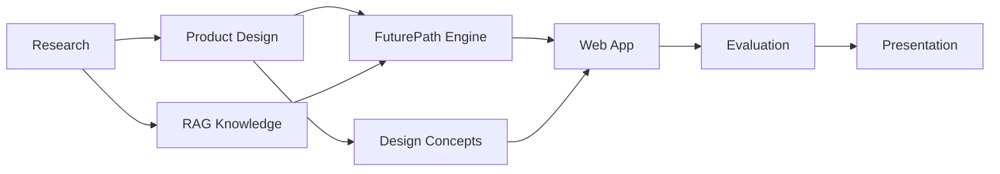

# 🚀 FutureMe / FuturePath AI

> **AI Career Discovery Platform for Thai Students**
> Workspace สำหรับ **JUMP THAILAND Hackathon 2026 — AIS Academy × NIA**

**FutureMe** คือชื่อผลิตภัณฑ์ที่ผู้ใช้เห็น
**FuturePath** คือ engine ภายในสำหรับวิเคราะห์ความสนใจ ประเมินข้อมูล และสร้างเส้นทางอนาคต

<p align="center">
  <strong>Discover yourself → Explore possibilities → Build your path.</strong>
</p>

---

## 🌟 Project Overview

FutureMe ถูกออกแบบให้เป็น AI Career Discovery Coach สำหรับนักเรียนไทย
ช่วยให้ผู้ใช้สำรวจความสนใจ ความถนัด และเป้าหมายของตัวเอง ผ่านแบบประเมินและ AI Interview ก่อนเปลี่ยนข้อมูลเหล่านั้นเป็นเส้นทางการเรียน อาชีพ และแผนลงมือทำที่ชัดเจน

Workspace นี้รวมตั้งแต่

**Research → AI Engine → Backend → Web App → UX/UI → Business → Presentation**

เพื่อให้สามารถตรวจสอบที่มาของแนวคิด งานวิจัย การออกแบบ และ implementation ได้จาก repository เดียว

> [!IMPORTANT]
> **Product source of truth ปัจจุบันอยู่ที่ [`03_WebApp/Pre_Present/`](03_WebApp/Pre_Present/)**
> เอกสารหรือ prototype ที่อยู่ใน `05_Team_Repo/` บางส่วนเป็น snapshot รุ่นเก่าและไม่ควรนำมาทับเวอร์ชันปัจจุบัน

---

# 🧭 Start Here

| ต้องการดู                      | ไปที่                                              |
| ------------------------------ | -------------------------------------------------- |
| 🔬 งานวิจัยและหลักฐาน          | [`01_Research/`](01_Research/)                     |
| 🧠 AI / Decision Engine / RAG  | [`02_Backend/`](02_Backend/)                       |
| 💻 Web App สำหรับ Demo         | [`03_WebApp/Pre_Present/`](03_WebApp/Pre_Present/) |
| 🎨 UX/UI และ Design Concepts   | [`04_Design/`](04_Design/)                         |
| 👥 งานจาก Team Repository      | [`05_Team_Repo/`](05_Team_Repo/)                   |
| 🖼️ Media / Source Assets      | [`06_Assets/`](06_Assets/)                         |
| 📦 งานเก่าและเอกสารอ้างอิง     | [`90_Archive/`](90_Archive/)                       |
| 🧾 Agent / Process Logs        | [`99_Process/`](99_Process/)                       |
| 📊 Slide Deck และ Presentation | [`Presentation/`](Presentation/)                   |

---

# 🗂️ Repository Structure

```text
FutureMe/
│
├── 01_Research/        Research, evidence, references & RAG knowledge
├── 02_Backend/         FastAPI, decision engine & RAG pipeline
├── 03_WebApp/          Next.js demo application
├── 04_Design/          UX/UI concepts, mockups & prototypes
├── 05_Team_Repo/       Team repository snapshot
├── 06_Assets/          Original media assets
├── 90_Archive/         Historical / deprecated materials
├── 99_Process/         Development process & agent logs
└── Presentation/       PPTX, PDF, generator & QA output
```

### Repository snapshot

| Directory                        | Role                      | Approx. size |
| -------------------------------- | ------------------------- | -----------: |
| [`01_Research/`](01_Research/)   | Research knowledge base   |      ~2.6 MB |
| [`02_Backend/`](02_Backend/)     | Backend + AI engine + RAG |      ~1.5 MB |
| [`03_WebApp/`](03_WebApp/)       | Next.js prototype source  |        ~4 MB |
| [`04_Design/`](04_Design/)       | 11 design directions      |       ~61 MB |
| [`05_Team_Repo/`](05_Team_Repo/) | Team repository snapshot  |       ~23 MB |
| [`06_Assets/`](06_Assets/)       | Original media assets     |       ~19 MB |
| [`90_Archive/`](90_Archive/)     | Archived materials        |       ~18 MB |
| [`99_Process/`](99_Process/)     | Process + agent logs      |      ~464 KB |
| [`Presentation/`](Presentation/) | Presentation package      |      ~4.7 MB |

> ขนาดของ `03_WebApp/` และ `05_Team_Repo/` ไม่รวม dependency, build cache และ nested `.git`

---

# 🔬 01 · Research

[`01_Research/`](01_Research/) คือฐานความรู้หลักของ FutureMe และเป็นแหล่งข้อมูลที่ใช้สนับสนุน product design, questionnaire, AI workflow และ RAG

### Research areas

`Data/` แบ่งงานวิจัยออกเป็น 7 กลุ่มหลัก

* Unemployment & education–career mismatch
* Thai education curriculum
* Career ↔ Skill mapping
* Career discovery interviews / RIASEC / STAR
* NDLP–DEEP
* AIS Cloud
* System architecture & blueprints

### Core documentation

| Document                                                     | Purpose                         |
| ------------------------------------------------------------ | ------------------------------- |
| [`Data/README.md`](01_Research/Data/README.md)               | Research index                  |
| [`Data/REFERENCES.md`](01_Research/Data/REFERENCES.md)       | Reference registry              |
| [`Data/SOURCE_AUDIT.md`](01_Research/Data/SOURCE_AUDIT.md)   | Claim / source verification     |
| [`Data/RAG_DATA_SPEC.md`](01_Research/Data/RAG_DATA_SPEC.md) | Knowledge specification for RAG |

### Thai AI System Research

[`Thai_AI_System_Research/`](01_Research/Thai_AI_System_Research/) เป็นคู่มือเชิงเทคนิค 18 บท ครอบคลุม

`Thai NLP` · `SLM` · `RAG` · `Embedding` · `LoRA / QLoRA` · `Evaluation` · `Security` · `Cost`

พร้อม `examples/` สำหรับโค้ดตัวอย่าง

### Source Documents

เอกสารต้นทางหลักอยู่ใน [`Source_Documents/`](01_Research/Source_Documents/)

```text
FutureMe_AI_Brief.pdf
FutureMe_AI_Deck.pdf
jump-thailand-2026-ideas/
```

---

# 🧠 02 · Backend & FuturePath Engine

[`02_Backend/`](02_Backend/) รวม Backend API, decision engine และ Retrieval-Augmented Generation pipeline

```text
02_Backend/
│
├── app/
│   ├── decision_engine/
│   │   ├── matrix
│   │   ├── multi_tier
│   │   ├── riasec
│   │   ├── route_generator
│   │   └── star_eval
│   │
│   ├── rag/
│   │   ├── pipeline
│   │   └── qdrant_client
│   │
│   └── api/
│       └── router.py
│
├── schemas/            11 Pydantic model files
├── scripts/
│   ├── verify_system
│   ├── generate_qwen_dataset
│   └── convert_data_to_pdf
│
└── tests/
    ├── test_api
    ├── test_decision_engine
    └── test_rag
```

### Recommended reading

📘 [`PROJECT.md`](02_Backend/PROJECT.md)
แผนการพัฒนาระบบ Milestone **M1 → M4**

📗 [`USER_MANUAL.md`](02_Backend/USER_MANUAL.md)
คู่มือระบบ **FuturePath v2.0.0**

---

# 💻 03 · Web App

## `Pre_Present/`

Prototype หลักสำหรับใช้พัฒนาและ Demo

**Stack**

`Next.js` · `TypeScript` · `Tailwind CSS`

GitHub repository:

`github.com/winxtxrgit/futureme-ai`

เอกสาร product และ implementation เพิ่มเติมอยู่ใน

[`03_WebApp/Pre_Present/docs/`](03_WebApp/Pre_Present/docs/)

> [!NOTE]
> `Pre_Present/` คือ **Product Source of Truth ล่าสุด** ของ workspace นี้

### Run locally

```bash
cd 03_WebApp/Pre_Present
npm install
npm run dev
```

จากนั้นเปิด

```text
http://localhost:3000
```

---

# 🎨 04 · Design

[`04_Design/`](04_Design/) คือพื้นที่ exploration สำหรับ UX/UI ของ FutureMe

มีทั้งหมด **11 design concepts**

```text
01_Concept_01/
02_Concept_02/
...
11_Concept_11/
```

แต่ละ concept อาจประกอบด้วย

`Wireframe` · `Mockup` · `Prototype` · `Assets`

### Selected Direction

✨ [`11_GenZ_Aurora_Direction/`](04_Design/11_GenZ_Aurora_Direction/)

เป็น direction หลักที่ถูกเลือกเพื่อนำไปพัฒนาต่อ

### Comparison

[`99_Final_Comparison/`](04_Design/99_Final_Comparison/)

ใช้เปรียบเทียบแนวทางทั้งหมดก่อนเลือก final direction

เปิด

```text
04_Design/99_Final_Comparison/index.html
```

เพื่อดู visual comparison

---

# 👥 05 · Team Repository

[`05_Team_Repo/`](05_Team_Repo/) เป็น snapshot จาก repository ของสมาชิกทีม

```text
github.com/Pongkarm/Future_Me
branch: pongkarm
```

ส่วนใหญ่มี Research และ Web App ที่จัดโครงสร้างใหม่ไว้แล้ว

แต่มีข้อมูลบางส่วนที่มีเฉพาะใน repository นี้

### Governance

```text
FutureMe_Consolidated/00_Governance/
```

ประกอบด้วย

* `SOURCE_POLICY`
* `CORRECTION_LOG`
* `CONTENT_STATUS`
* `RAG_INDEX_MANIFEST`

### Business & Competition

```text
FutureMe_Consolidated/07_Business_and_Competition/
```

ครอบคลุม

`Business strategy` · `Pilot metrics` · `Competition` · `Pitch script`

### Infrastructure Report

```text
reports/futureme-ai-infrastructure/
```

เป็น infrastructure research คนละชุดกับเอกสารที่อยู่ใน `90_Archive/`

> [!WARNING]
> Product documents ภายใน
> `04_Product_and_UX/` และ `90_Assets/Pre_Present/`
> เป็น snapshot **ก่อน PR #6**
>
> สำหรับสถานะปัจจุบัน ให้ยึด
> [`03_WebApp/Pre_Present/`](03_WebApp/Pre_Present/) เป็นหลัก

---

# 🖼️ 06 · Assets

[`06_Assets/`](06_Assets/) เก็บ media และ source assets ต้นฉบับที่ใช้ใน

* Web App
* Design prototypes
* Research
* Presentation

แยกออกจาก generated output เพื่อให้สามารถติดตามต้นฉบับได้ง่าย

---

# 📦 90 · Archive

[`90_Archive/`](90_Archive/) ใช้เก็บงานเก่าที่อาจยังมีประโยชน์สำหรับการอ้างอิง แต่ไม่ใช่ working source ปัจจุบัน

ตัวอย่าง

```text
FutureMe_AI_Master_Report.pdf
FutureMe_AI_Master_Report.html

3D videos × 2

reports/
└── futureme-ai-version2/
```

ข้อมูล `Data/` ที่เคยซ้ำกับ Research ถูกลบออกแล้ว

**ต้นฉบับปัจจุบันอยู่ที่**

[`01_Research/Data/`](01_Research/Data/)

---

# 🧾 99 · Process

[`99_Process/`](99_Process/) ใช้เก็บหลักฐานและประวัติกระบวนการพัฒนา

### Original Request

[`ORIGINAL_REQUEST.md`](99_Process/ORIGINAL_REQUEST.md)

โจทย์และ requirement ตั้งต้นของโครงการ

### Agent Logs

```text
.agents/
```

บันทึก workflow จาก **18 agents** ที่ทำงานตาม Milestone M1–M4

ใช้สำหรับตรวจสอบว่า

* แนวคิดมาจากไหน
* มีการ research อะไร
* ตัดสินใจอะไรไปแล้ว
* implementation เปลี่ยนอย่างไรระหว่าง development

---

# 📊 Presentation

[`Presentation/`](Presentation/) คือชุดไฟล์สำหรับนำเสนอ FutureMe

| File                                 | Description               |
| ------------------------------------ | ------------------------- |
| `FutureMe_Project_Presentation.pptx` | Slide deck ที่แก้ไขได้    |
| `FutureMe_Project_Presentation.pdf`  | PDF presentation 15 หน้า  |
| `generate_presentation.py`           | Source generator          |
| `rendered/`                          | Rendered slides สำหรับ QA |
| `QA.md`                              | ผลตรวจคุณภาพรายหน้า       |

---

# 🔄 Source of Truth

เพื่อป้องกันข้อมูลคนละเวอร์ชัน ให้ใช้ลำดับความสำคัญดังนี้

```text
Product / UX
03_WebApp/Pre_Present/
        ↓
05_Team_Repo/ snapshots
        ↓
90_Archive/


Research
01_Research/
        ↓
05_Team_Repo/ research snapshot
        ↓
90_Archive/
```

เมื่อข้อมูลขัดแย้งกัน ให้ยึด source ที่อยู่สูงกว่าในลำดับนี้

---

# 🛠️ Development Workflow



แนวทางของ workspace ถูกออกแบบให้สามารถย้อนกลับจาก feature ไปหา research หรือ source ที่สนับสนุน feature นั้นได้

---

# 🧹 GitHub Snapshot Policy

Repository เก็บ source ที่จำเป็นสำหรับการพัฒนาและตรวจสอบงาน

แต่ **ไม่ commit** ไฟล์ที่สามารถสร้างใหม่ได้, build cache หรือ nested repository metadata

```gitignore
node_modules/
.next/
test-results/
__pycache__/
*.tsbuildinfo
.DS_Store
.git/
```

เป้าหมายคือให้ repository

* Clone ได้สะอาด
* ลดไฟล์ที่ไม่จำเป็น
* ไม่เก็บ dependency ซ้ำ
* ไม่เก็บ build output
* ไม่ฝัง Git repository ซ้อนกัน

---

# 📌 Project Status

**Workspace restructuring:** 29 July 2026
**GitHub snapshot updated:** 30 July 2026

Current focus:

**Research-backed Career Discovery → FuturePath Engine → Demo-ready Web App → Hackathon Presentation**

---

<p align="center">
  <strong>FutureMe</strong><br/>
  Helping Thai students understand themselves before choosing their future.
</p>

<p align="center">
  <sub>Built for JUMP THAILAND Hackathon 2026 · AIS Academy × NIA</sub>
</p>
