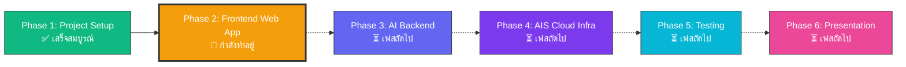
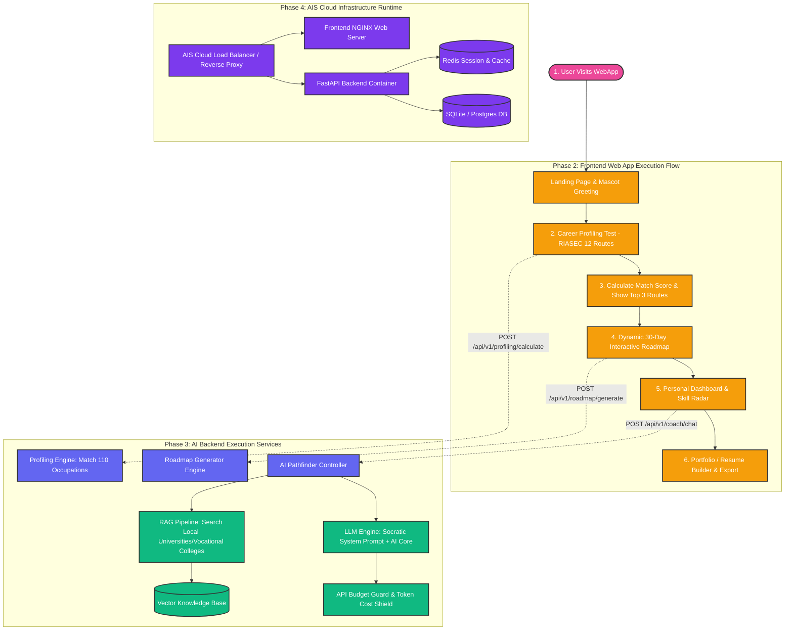
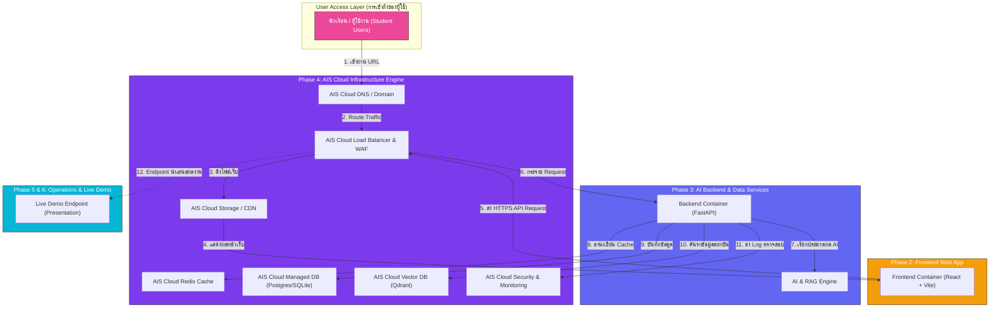

# FutureMe — System Architecture & Execution Process Guide

เอกสารสรุป **โครงสร้างการทำงานเชิงลึก (Deep-Dive Architecture)**, **แผนภาพการประมวลผลระบบ (Execution Process Diagram)** และ **สถานะการพัฒนาโครงการ FutureMe** สำหรับใช้เป็นคู่มืออ้างอิงและการนำเสนอผลงาน

---

## 1. ภาพรวมสถานะโครงการตาม Roadmap (Project Phase Status)

โครงการ **FutureMe** เป็นระบบแนะแนวการศึกษาและอาชีพ AI สำหรับนักเรียน ม.3 เพื่อการตัดสินใจเลือกสายการเรียนต่อ โดยมีแผนการดำเนินงานแบ่งเป็น 6 เฟสหลักดังนี้:

### สรุปสถานะปัจจุบัน:
- 🟢 **Phase 1: Project Setup**: วาง Taxonomy 110 อาชีพ, โมเดลจิตวิทยา RIASEC 12 เส้นทาง และงานวิจัยระบบ
- 🟧 **Phase 2: Frontend Web App (กำลังทำ 🚧)**: พัฒนาตัวเว็บไซต์ Interactive Prototype (React + Vite) ประกอบด้วย 6 โมดูลหลัก
- 🟦 **Phase 3: AI Backend**: เตรียมเชื่อมต่อ FastAPI Backend, RAG Pipeline และ AI Model Core
- 🟪 **Phase 4: AIS Cloud Infra**: เตรียมความพร้อมสำหรับการ Deploy บน AIS Cloud Infrastructure
- 🩵 **Phase 5: Testing**: การทดสอบระบบและ E2E Tests
- 💗 **Phase 6: Presentation**: การจัดทำสไลด์และเตรียมนำเสนอผลงาน

---

## 2. End-to-End Execution Process Diagram (แผนภาพรวมการประมวลผลทั้งระบบ)

แผนภาพแสดงการประมวลผลตามลำดับขั้นตอน (Execution Flow) ตั้งแต่ฝั่งผู้ใช้งาน (Phase 2) การประมวลผลระบบหลังบ้าน (Phase 3) จนถึงสภาพแวดล้อมรันไทม์บน cloud (Phase 4):

---

## 3. โครงสร้างการทำงานของ Phase 2 (Frontend Web App Modules)

เว็บไซต์ที่กำลังพัฒนาอยู่ในปัจจุบัน ประกอบด้วย 6 โมดูลหลักที่เชื่อมโยงกันดังนี้:

| โมดูล (Module) | ไฟล์ซอร์สโค้ด | หน้าที่และการทำงานเชิงลึก |
| :--- | :--- | :--- |
| **1. Landing Page** | `LandingPage.jsx` | หน้าแรกต้อนรับด้วย Mascot Interactive ให้ข้อมูลโครงการ และปุ่มเลือกเริ่มต้น |
| **2. Career Profiling** | `CareerProfiling.jsx` | แบบทดสอบจิตวิทยา RIASEC 12 เส้นทางอาชีพ คำนวณเป็น 3 สายเรียนเด่นพร้อม % Match |
| **3. Dynamic Roadmap** | `DynamicRoadmap.jsx` | แสดงแผนปฏิบัติการ 30 วันแบบ Visual Interactive Ribbon กดเลือกภารกิจและติ๊กเสร็จแล้วได้ |
| **4. Personal Dashboard** | `PersonalDashboard.jsx` | แดชบอร์ดสรุปความก้าวหน้า แสดงกราฟทักษะ (Skill Radar) และสถิติส่วนบุคคล |
| **5. Portfolio Builder** | `PortfolioBuilder.jsx` | รวบรวมข้อมูลการประเมินและทักษะ สรุปเป็นไฟล์ Resume / Portfolio พร้อมส่งออก |
| **6. Language System** | `LanguageContext.jsx` | ระบบจัดการสลับภาษา (TH/EN) รองรับการใช้งานสองภาษาทั่วทั้งเว็บ |

---

## 4. แผนผังจุดเชื่อมต่อ Phase 4 (AIS Cloud Integration Architecture)

แผนภาพแสดงจุดที่ **Phase 4 (AIS Cloud Infra)** เข้าไปห่อหุ้มและเชื่อมต่อกับทุกส่วนของระบบ:

---

## 5. ตารางสรุปจุดเชื่อมโยงระบบ (System Integration Matrix)

| ส่วนประกอบ | โมดูลที่เชื่อมต่อ | หน้าที่ของ AIS Cloud Infra (Phase 4) |
| :--- | :--- | :--- |
| **Static Web Hosting** | Phase 2 Frontend (React/Vite) | โฮสต์ไฟล์ Static Web App และกระจายผ่าน CDN ให้โหลดหน้าเว็บได้รวดเร็ว |
| **API Compute Services** | Phase 3 Backend (FastAPI) | รัน Container Backend API พร้อมระบบ Auto-scaling เมื่อมีผู้ใช้งานเพิ่มขึ้น |
| **Database & Vector Storage** | Database / Vector Index | โฮสต์คลังข้อมูล 110 อาชีพ ข้อมูลโรงเรียน และ Vector DB สำหรับ RAG |
| **Security & Gateway** | Auth & API Guard | บริการ Load Balancer, SSL Certificate, WAF ป้องกันระบบ และควบคุม Rate Limit |
| **Live Presentation** | Phase 6 Live Demo | ให้บริการ Public URL สำหรับการสาธิตระบบสดในวันนำเสนอผลงาน |
