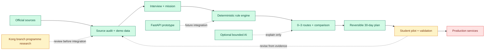
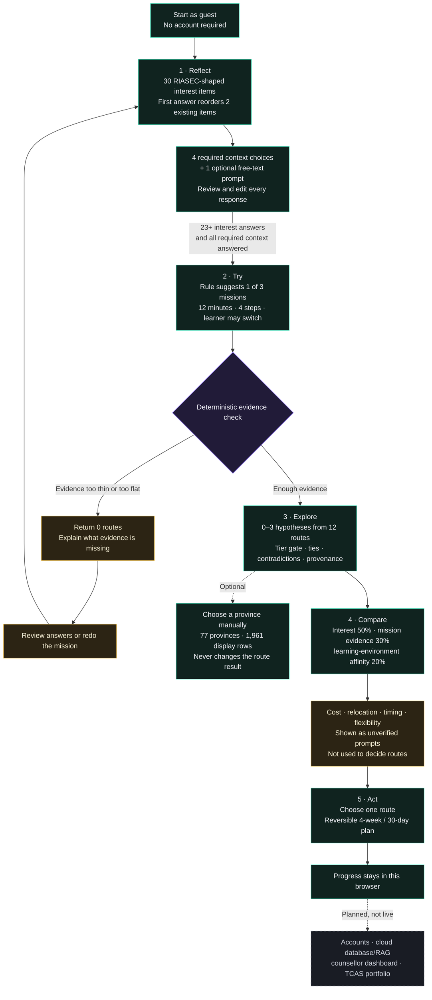

<a id="top"></a>

**README:** **[EN](README.md)** · [TH](READMETH.md)

<p align="center">
  
</p>

# FutureMe AI

<p align="center">
  <strong>Career and study exploration for Thai students</strong><br>
  Reflect → Try → Explore → Compare → Act
</p>

<p align="center">
  <a href="#how-the-project-works">How it works</a>
  &nbsp;·&nbsp;
  <a href="#current-status">Current status</a>
  &nbsp;·&nbsp;
  <a href="#repository-guide">Repository</a>
  &nbsp;·&nbsp;
  <a href="#run-locally">Run locally</a>
  &nbsp;·&nbsp;
  <a href="Presentation/FutureMe_Project_Presentation.pdf">Presentation</a>
  &nbsp;·&nbsp;
  <a href="#quick-faq">FAQ</a>
</p>

<p align="center"><sub>Documentation and cross-branch data reviewed 16 August 2026. The latest full app-verification snapshot remains 11 August 2026.</sub></p>

---

## Overview

FutureMe is a decision-support prototype for Thai lower-secondary, upper-secondary, and vocational
students. It combines 30 interest-reflection items whose first answer only reorders two existing
items, five context prompts, a short scenario mission, explainable comparison of up to three study
or career-route hypotheses, a province-aware nearby-institution lookup, and a reversible 30-day
action plan. It does not choose one “perfect career,” guarantee admission, or claim that a listed
institution offers a particular programme.

| Question | Answer |
|---|---|
| **Who is it for?** | Thai students exploring their next study or career direction |
| **What does it produce?** | Zero to three route hypotheses with reasons, limitations, comparisons, nearby-institution information, and a 30-day plan |
| **What runs in this demo?** | 30 interest items + 5 context prompts, 3 missions, 12 illustrative routes, and 1,961 nearby-institution display rows across all 77 provinces |
| **Does AI decide the result?** | No. A deterministic rule engine selects routes; optional AI may only explain them or answer bounded repository questions |
| **Is it production-ready?** | No. It is a runnable, tested hackathon prototype that still needs validated data and a real-student pilot |

### Latest web app preview

Captured from this repository's production build on 9 August 2026. They cover the
integrated learner flow; source code and automated tests remain the authoritative implementation record.

<table>
  <tr>
    <th>Landing</th>
    <th>Interview</th>
  </tr>
  <tr>
    <td><a href="03_WebApp/assets/screenshots/app/landing-2026-08-09.png"></a></td>
    <td><a href="03_WebApp/assets/screenshots/app/interview-2026-08-09.png"></a></td>
  </tr>
  <tr>
    <th>Routes</th>
    <th>30-day plan</th>
  </tr>
  <tr>
    <td><a href="03_WebApp/assets/screenshots/app/routes-2026-08-09.png"></a></td>
    <td><a href="03_WebApp/assets/screenshots/app/plan-2026-08-09.png"></a></td>
  </tr>
</table>

---

## How the project works

### Complete workflow



The end-to-end prototype is runnable (green). Real-student validation is next (yellow). Production
accounts, permanent storage, and deployment remain planned (red).

### Student journey



This diagram is the workflow implemented on **Panussu**. Optional AI can explain or reword results,
but it does not select routes. Kong's fixed 41-prompt questionnaire and programme matcher are
separate branch work and are not used by this runtime yet.

### Recommendation logic

The current design weights are:

`Interests 50% · Mission evidence 30% · Learning-environment affinity 20%`

The last component is a team-defined projection of the same interview profile onto a route's
learning environment. It is not a learning-styles test and is not independent evidence.

The engine can refuse to recommend, show ties, and identify contradictions. These weights are
product rules, not validated psychometric findings.

Cost, relocation, time-to-earning, and flexibility are unverified planning prompts. They remain
visible for discussion but do not score, rank, or remove a route.

### AI, privacy, and data flow

- Assessment, mission, route, and plan data stay in browser storage by default.
- Route selection works without an account, database, backend, or API key.
- Optional AI can reword fixed explanations or answer bounded repository questions. It cannot change routes.
- A funded provider key must not be exposed publicly without authentication, rate limits, spend controls, and reviewed retention terms.

---

## Architecture

| Component | Role | Current state |
|---|---|---|
| **Next.js web app** | Student journey, local session, decision engine, comparison, plan, and chat UI | ✅ Runnable |
| **Demo inputs** | 30 interest items + 5 context prompts, 3 missions, 12 illustrative routes, and a 77-province nearby-institution lookup | 🟡 Research-informed prototype data |
| **Research layer** | Source audit, curricula, labour data, claim status, and technical research | 🟡 First audit complete |
| **Education data registry** | Institution / Program / Admission / Financial / Location coverage, sources, dates, gaps, and decision-use limits | ✅ Machine-checked |
| **Kong branch research** | 23,257-programme index, six self-efficacy prompts, and a separate deterministic programme matcher | 🟡 Implemented on Kong19565; not integrated into Panussu |
| **FastAPI backend** | Mission and future-path API reference with in-memory storage | 🟡 Separate prototype |
| **Optional AI** | Bounded chat and explanation rewording | 🟡 Optional |
| **Production services** | Accounts, permanent database, RAG, school tools, and cloud deployment | 🔴 Planned |

The current web app is the product source of truth. The FastAPI backend is not required by or wired
into the main demo journey. A few backend schema and class identifiers retain the historical
`FuturePath` name for import compatibility; the product name is **FutureMe AI**.

### Data reviewed from Kong19565

<details>
<summary><strong>Open the verified cross-branch snapshot (not live on Panussu)</strong></summary>

The following is verified from [Kong19565 at `df5632f`](https://github.com/Pongkarm/Future_Me/tree/df5632f156b60fec81ddf9712cbcb8d06b74ba05),
reviewed 16 August 2026. It is useful integration work, but it is not part of the current Panussu runtime.

| Kong branch asset | Verified scope | Boundary before Panussu can claim it |
|---|---|---|
| **Questionnaire extension** | Fixed sequence of 30 interest + 6 researcher-written self-efficacy + 5 context prompts = 41 prompts before review | Not CAT, IRT, Akinator-style, or answer-selected; the six added items are unvalidated |
| **Programme index** | 23,257 records: 6,349 bachelor's, 9,191 ปวช., and 7,717 ปวส.; 993 institutions and 269 fields | 15,586 records include outcome data; 16,909 lack production-cost data, and production cost is not learner tuition |
| **Programme matcher** | Core fit uses 70% interest cosine + 30% self-efficacy when available; context can move the score by at most 15 points; deterministic refusal gates return up to five matches | These are design weights, not outcome-fitted parameters. This layer is separate from the 50/30/20 route engine and does not drive route comparison or the 30-day plan |
| **Known evidence gaps** | No verified learner-paid tuition, TCAS rounds/requirements/scores, scholarships, or programme-level financial aid | The field-to-occupation crosswalk is team-created and not expert-reviewed; five-region living costs are estimates |

The supplied AIS Cloud workflow is therefore a **target architecture**, not a current-system diagram.
AIS Cloud hosting, GPU compute, Qdrant, accounts, counsellor dashboards, native mobile, automatic
feedback loops, and TCAS portfolios remain proposed unless a later branch implements and verifies them.

</details>

---

<a id="current-status"></a>

## Current status

### ✅ Working now

- Complete guest journey from assessment to a 30-day plan
- A deterministic first-answer ordering rule that moves two reviewed items forward without changing the 30-item bank or scoring
- English and Thai interfaces, responsive layouts, and light/dark/system themes
- Deterministic scoring, refusal gates, ties, provenance, and freshness warnings
- Local persistence, deletion controls, optional research export, and analysis scripts
- Mascot animation enabled by default across the journey, with a persisted system-motion opt-out
- Twelve illustrative routes and province-aware nearby-institution views that do not claim a specific programme is offered
- Machine-checked education-data coverage: 1,417 source institutions, 1,375 unique institutions shown, 140 with programme-derived route mappings, and zero locally validated admission or financial records
- Mascot sync, typecheck, lint, unit/integration tests, production build, and browser journeys are included in the repository checks
- Verification snapshot (11 August 2026): 27 Vitest files / 533 tests and all 95 Playwright browser
  journeys pass; data-integrity and production-build checks pass; the disconnected backend scaffold
  also passes 18 contract tests and its safety-boundary verifier

### 🟡 Needs validation

- The question set and Thai adaptation have not been validated with real students.
- The experimental 1,000-row future asset is generated from 148 base prompts (some repeated up to 19 times). It passes structural checks but is not used live; its wording, fairness, scoring, and branching still require expert and student validation.
- The three first-answer branches are transparent product heuristics, not CAT, IRT, or evidence that the assessment is more accurate.
- Route costs, relocation, time-to-earning, flexibility, strengths, and limitations include team estimates; the first four are held out of route decisions.
- The institution register keeps 207 missing or quarantined coordinates and 987 missing websites as unknown instead of inventing values.
- Route and programme metadata need recurring source review; source dates, full checksums, and automated integrity checks are recorded with the geography data.
- Programme-level TCAS criteria, tuition, scholarships, accommodation, and living costs have no validated local records and remain unavailable rather than estimated.
- Research has passed a first source audit, not a guarantee of permanent accuracy.
- Automated integration checks pass, but source-data review and a real-student pilot are still required.

### 🔴 Not implemented

- Real accounts, permanent server storage, and production authentication
- Parent and counsellor dashboards
- Live school, TCAS, NDLP/DEEP, or AIS API integration
- Production RAG, cloud deployment, ethics approval, and a real-student pilot

---

<a id="repository-guide"></a>

## Repository guide

Only the active product, evidence, and reproducible deliverables remain:

| Path | Purpose |
|---|---|
| [`01_Research/`](01_Research/) | Audited evidence, questionnaire research, and geography/data pipelines |
| [`02_Backend/`](02_Backend/) | Disconnected FastAPI architecture scaffold and tests |
| [`03_WebApp/`](03_WebApp/) | Current runnable FutureMe product and its automated tests |
| [`04_Design/FutureMe_Mascot_Lab/`](04_Design/FutureMe_Mascot_Lab/) | Canonical mascot assets synchronized into the web app |
| [`Presentation/`](Presentation/) | Current editable deck, matching PDF, evidence notes, and QA record |

Historical snapshots, superseded design concepts, generated renders, private source media, and
agent working logs are intentionally excluded from this branch. Deleted tracked files remain
recoverable from Git history.

---

<a id="run-locally"></a>

## Run locally

Requirements: Node.js 20 or newer.

```bash
cd 03_WebApp
npm ci
npm run dev
```

Open [http://localhost:3000](http://localhost:3000) and choose **Start as guest**.

---

<a id="quick-faq"></a>

## Quick FAQ

<details>
<summary><strong>Can I use the demo without AI or the backend?</strong></summary>

Yes. The complete student journey runs locally in the browser without either one.
</details>

<details>
<summary><strong>What evidence motivates the problem, and does it validate FutureMe?</strong></summary>

TDRI reports that 56% of Thais educated beyond upper secondary work outside their field and 27%
work below their skill or qualification level. WEF employers expect 39% of core skills to change
by 2030. These figures motivate the problem; they do not prove that FutureMe is effective. See the
[scoped research summary](01_Research/Data/01_Graduate_Unemployment_and_Mismatch_Stats/SUMMARY.md).
</details>

<details>
<summary><strong>Does FutureMe guarantee admission or employment?</strong></summary>

No. Routes are hypotheses to explore, not predictions or guarantees.
</details>

<details>
<summary><strong>Does it recommend a university using TCAS, tuition, scholarship, or distance data?</strong></summary>

No. The route engine does not select institutions. The nearby screen is a directory ordered by
distance from a province centre. Only 140 of 1,375 displayed institutions have partial
programme-derived route mappings; programme-level TCAS, tuition, scholarships, accommodation,
and living costs have zero validated local records. See the
[data coverage contract](03_WebApp/docs/data-coverage-and-governance.md).
</details>

<details>
<summary><strong>Does Panussu already use Kong's 23,257-programme matcher?</strong></summary>

No. Kong19565 contains that index and a separate top-five deterministic matcher, but those files are
not imported by Panussu. The current Panussu result is still 0–3 illustrative route hypotheses;
nearby institutions are a downstream directory and never change the route result.
</details>

<details>
<summary><strong>Is this a validated RIASEC test?</strong></summary>

No. It uses the RIASEC structure for reflection, but this item set and its Thai adaptation still require validation.
</details>

<details>
<summary><strong>Does the live interview use the experimental 1,000-row question asset?</strong></summary>

No. Its 1,000 rows were generated from 148 base prompts by adding context variants, with some bases
repeated up to 19 times. It is preserved and structurally checked for later research. The live
interview still uses all 30 reviewed items in `questions.json`; the first answer only changes which
two existing items appear next. This is deterministic rule-based ordering, not CAT or IRT.
</details>

<details>
<summary><strong>Where is learner data stored?</strong></summary>

Assessment, mission, and plan state stays in the current browser's `localStorage`; the prototype
has no application database or server-side transcript store. Explanation requests send only a
route id and fixed reason codes. Chat sends a bounded transcript only when the learner presses
Send and may reach the configured provider. Deployment infrastructure may still keep request logs.
</details>

<details>
<summary><strong>Which architecture is implemented, and which parts are only proposed?</strong></summary>

The implemented product is a Next.js/TypeScript guest app with a client-side decision engine and
browser storage. FastAPI, PostgreSQL, Qdrant, BGE-M3, Kubernetes, AIS Cloud, identity, and school
integrations are documented production designs, not running components. See the
[architecture boundary](03_WebApp/docs/05-system-architecture.md).
</details>

<details>
<summary><strong>Can a recommendation be reproduced and audited?</strong></summary>

Yes. The same accepted inputs and catalogue produce the same routes because scoring, filters,
ties, and refusal gates are deterministic TypeScript. The UI exposes the catalogue date, reasons,
unknowns, and provenance. The fixed weights are design judgement, not
parameters fitted to outcome data; automated tests verify implementation behaviour, not real-world validity.
</details>

<details>
<summary><strong>How are route-data lineage and freshness handled?</strong></summary>

The seeded catalogue records a source status, source URL, and last-verified date per route, plus a
catalogue-wide `dataAsOf` date and 180-day freshness threshold. The UI warns when data is stale and
identifies unsourced fields. Cost, relocation, time-to-earning, and flexibility are held out of
decisions; strengths and limitations remain illustrative copy. The geography registry records full
checksums and `npm run check:data` verifies its cross-file integrity. See the
[source review](03_WebApp/docs/09-source-review.md) and
[data coverage contract](03_WebApp/docs/data-coverage-and-governance.md).
</details>

<details>
<summary><strong>What evidence is still required before a real-student pilot?</strong></summary>

The project needs ethics approval, parental consent and student assent, formal Thai adaptation,
cognitive interviews, a representative pilot, reliability and structural analysis, subgroup
invariance checks, and licensed current route data. Recommendation weights then need calibration
against observed exploration outcomes. See the
[validation plan](03_WebApp/docs/validation-plan.md).
</details>

<details>
<summary><strong>How should product success be measured?</strong></summary>

Use evidence of better decisions, not model confidence or click volume: completion of the 30-day
experiments, follow-through on route research, changes in decision confidence, counsellor review,
and whether learners can explain their next step and its trade-offs. Longer-term evaluation should
track enrolment or persistence without treating one route as the universal correct answer.
</details>

<details>
<summary><strong>Where are the main documents?</strong></summary>

[Web README](03_WebApp/READMEEN.md) ·
[Architecture](03_WebApp/docs/05-system-architecture.md) ·
[Source review](03_WebApp/docs/09-source-review.md) ·
[Research guide](01_Research/Data/README.md) ·
[Presentation PDF](Presentation/FutureMe_Project_Presentation.pdf)
</details>

---

FutureMe is a student-built exploration prototype for JUMP THAILAND Hackathon 2026. It cannot
predict admission, employment, income, or mental-health risk and should not replace official,
current information or human guidance.

<p align="center"><a href="#top">Back to top</a></p>
