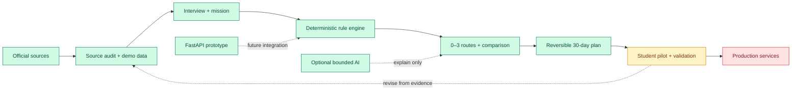

<a id="top"></a>

<p align="center">
  
</p>

# FutureMe AI

<p align="center">
  <strong>Career and study exploration for Thai students</strong><br>
  Reflect → Try → Compare → Act
</p>

<p align="center">
  <a href="README.md"><strong>EN</strong></a>
  &nbsp;·&nbsp;
  <a href="READMETH.md">TH</a>
  &nbsp;·&nbsp;
  <a href="#how-the-project-works">How it works</a>
  &nbsp;·&nbsp;
  <a href="#current-status">Current status</a>
  &nbsp;·&nbsp;
  <a href="#run-locally">Run locally</a>
  &nbsp;·&nbsp;
  <a href="#quick-faq">FAQ</a>
</p>

---

## Overview

FutureMe is a decision-support prototype for Thai lower-secondary, upper-secondary, and vocational
students. It combines interest reflection, a short scenario mission, explainable route comparison,
and a reversible 30-day action plan. It does not choose one “perfect career.”

| Question | Answer |
|---|---|
| **Who is it for?** | Thai students exploring their next study or career direction |
| **What does it produce?** | Zero to three route hypotheses, reasons, limitations, comparisons, and a 30-day plan |
| **Does AI decide the result?** | No. A deterministic rule engine selects routes; optional AI may only explain them |
| **Is it production-ready?** | No. It is a runnable, tested hackathon prototype that still needs validated data and a real-student pilot |

### Latest web app preview

Captured from this repository's running production build on 9 August 2026.

<table>
  <tr>
    <th>Landing</th>
    <th>Interview</th>
  </tr>
  <tr>
    <td><a href="03_WebApp/Pre_Present/assets/screenshots/app/landing-2026-08-09.png"></a></td>
    <td><a href="03_WebApp/Pre_Present/assets/screenshots/app/interview-2026-08-09.png"></a></td>
  </tr>
  <tr>
    <th>Routes</th>
    <th>30-day plan</th>
  </tr>
  <tr>
    <td><a href="03_WebApp/Pre_Present/assets/screenshots/app/routes-2026-08-09.png"></a></td>
    <td><a href="03_WebApp/Pre_Present/assets/screenshots/app/plan-2026-08-09.png"></a></td>
  </tr>
</table>

---

## How the project works

### Complete workflow



The end-to-end prototype is runnable (green). Real-student validation is next (yellow). Production
accounts, permanent storage, and deployment remain planned (red).

### Student journey

| Step | What happens |
|---|---|
| **1. Reflect** | Answer 30 RIASEC-shaped interest items, four required context questions, and one optional prompt |
| **2. Try** | Complete one of three short scenario missions |
| **3. Explore** | The rule engine checks the evidence and returns zero to three routes |
| **4. Compare** | Compare every route using the same five criteria |
| **5. Act** | Choose one route to explore through a reversible 30-day plan |

### Recommendation logic

The current design weights are:

`Interests 30% · Feasibility 25% · Mission evidence 20% · Learning style 15% · Flexibility 10%`

The engine can refuse to recommend, show ties, and identify contradictions. These weights are
product rules, not validated psychometric findings.

### AI, privacy, and data flow

- Assessment, mission, route, and plan data stay in browser storage by default.
- Route selection works without an account, database, backend, or API key.
- Optional AI can reword fixed explanations or answer bounded repository questions. It cannot change routes.
- A funded provider key must not be exposed publicly without authentication, rate limits, spend controls, and reviewed retention terms.

---

## Architecture

| Component | Role | Current state |
|---|---|---|
| **Next.js web app** | Student journey, local session, decision engine, comparison, plan, and chat UI | ✅ Runnable |
| **Seed data** | 30 questions, 3 missions, and 6 illustrative routes | 🟡 Demo data |
| **Research layer** | Source audit, curricula, labour data, claim status, and technical research | 🟡 First audit complete |
| **FastAPI backend** | Mission and future-path API reference with in-memory storage | 🟡 Separate prototype |
| **Optional AI** | Bounded chat and explanation rewording | 🟡 Optional |
| **Production services** | Accounts, permanent database, RAG, school tools, and cloud deployment | 🔴 Planned |

The current web app is the product source of truth. The FastAPI backend is not required by or wired
into the main demo journey. Some backend files still use the older name **FuturePath AI**; the
current product name is **FutureMe AI**.

---

<a id="current-status"></a>

## Current status

### ✅ Working now

- Complete guest journey from assessment to a 30-day plan
- English and Thai interfaces, responsive layouts, and light/dark/system themes
- Deterministic scoring, refusal gates, ties, provenance, and freshness warnings
- Local persistence, deletion controls, optional research export, and analysis scripts
- Mascot UI with offline fallbacks for optional chat and explanations
- Mascot sync, typecheck, lint, 400 unit/integration tests, production build, and 64 Playwright browser journeys all pass

### 🟡 Needs validation

- The question set and Thai adaptation have not been validated with real students.
- Route costs, relocation, time-to-earning, flexibility, strengths, and limitations include team estimates.
- Route data is dated `2026-01-15` and has passed its 180-day review threshold.
- Research has passed a first source audit, not a guarantee of permanent accuracy.
- Automated integration checks pass, but source-data review and a real-student pilot are still required.

### 🔴 Not implemented

- Real accounts, permanent server storage, and production authentication
- Parent and counsellor dashboards
- Live school, TCAS, NDLP/DEEP, or AIS API integration
- Production RAG, cloud deployment, ethics approval, and a real-student pilot

---

<a id="run-locally"></a>

## Run locally

Requirements: Node.js 20 or newer.

```bash
cd 03_WebApp/Pre_Present
npm ci
npm run dev
```

Open [http://localhost:3000](http://localhost:3000) and choose **Start as guest**.

---

<a id="quick-faq"></a>

## Quick FAQ

<details>
<summary><strong>Can I use the demo without AI or the backend?</strong></summary>

Yes. The complete student journey runs locally in the browser without either one.
</details>

<details>
<summary><strong>Does FutureMe guarantee admission or employment?</strong></summary>

No. Routes are hypotheses to explore, not predictions or guarantees.
</details>

<details>
<summary><strong>Is this a validated RIASEC test?</strong></summary>

No. It uses the RIASEC structure for reflection, but this item set and its Thai adaptation still require validation.
</details>

<details>
<summary><strong>Where is learner data stored?</strong></summary>

Assessment progress is stored in the current browser by default. Optional chat messages follow a
separate network flow only when the learner sends them.
</details>

<details>
<summary><strong>Which part should developers change first?</strong></summary>

Use `03_WebApp/Pre_Present/` for current product work. Refresh and validate route data before a pilot.
</details>

<details>
<summary><strong>Where did the README screenshots come from?</strong></summary>

They were captured directly from the production build in `03_WebApp/Pre_Present/` by completing a
real guest journey in the running app.
</details>

<details>
<summary><strong>Where are the main documents?</strong></summary>

[Web README](03_WebApp/Pre_Present/READMEEN.md) ·
[Architecture](03_WebApp/Pre_Present/docs/05-system-architecture.md) ·
[Source review](03_WebApp/Pre_Present/docs/09-source-review.md) ·
[Research guide](01_Research/Data/README.md) ·
[Presentation PDF](Presentation/FutureMe_Project_Presentation.pdf)
</details>

---

FutureMe is a student-built exploration prototype for JUMP THAILAND Hackathon 2026. It cannot
predict admission, employment, income, or mental-health risk and should not replace official,
current information or human guidance.

<p align="center"><a href="#top">Back to top</a></p>
