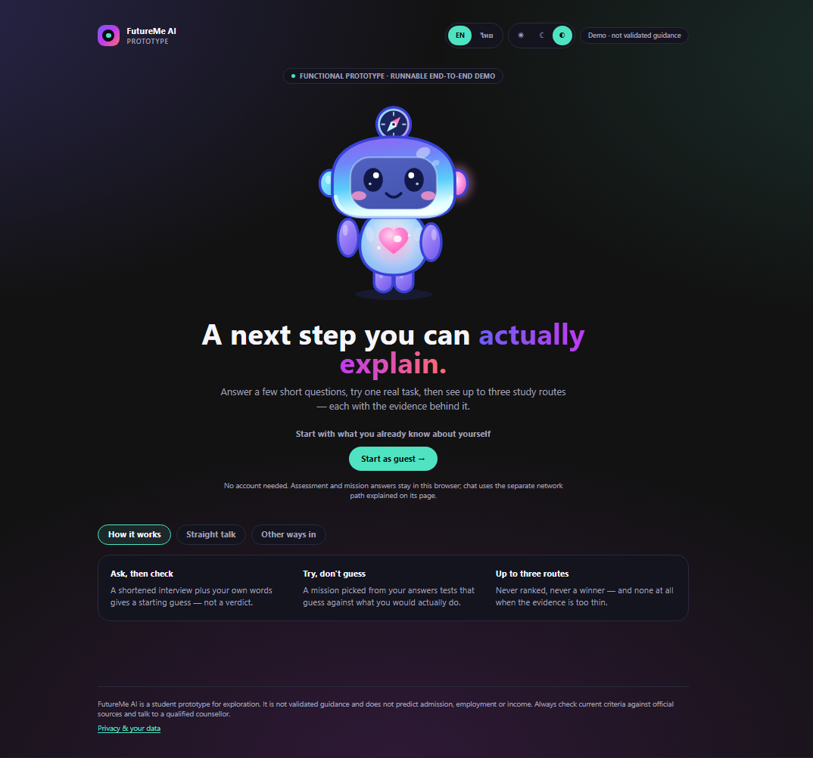
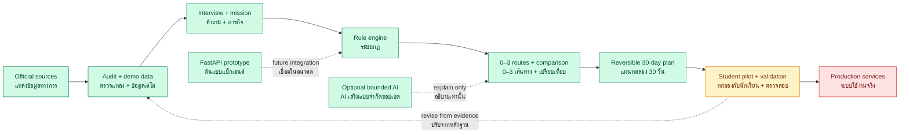

<a id="top"></a>

<p align="center">
  
</p>

# FutureMe AI

<p align="center">
  <strong>Career and study exploration for Thai students</strong><br>
  <strong>ตัวช่วยสำรวจเส้นทางเรียนและอาชีพสำหรับนักเรียนไทย</strong>
</p>

<p align="center">
  Reflect → Try → Compare → Act<br>
  ทบทวน → ทดลอง → เปรียบเทียบ → ลงมือทำ
</p>

<p align="center">
  <a href="#how-the-project-works--โปรเจกต์ทำงานอย่างไร">How it works · วิธีทำงาน</a>
  &nbsp;·&nbsp;
  <a href="#where-we-are-now--สถานะปัจจุบัน">Current status · สถานะปัจจุบัน</a>
  &nbsp;·&nbsp;
  <a href="#run-locally--รันในเครื่อง">Run locally · รันในเครื่อง</a>
  &nbsp;·&nbsp;
  <a href="#quick-faq--คำถามที่พบบ่อย">FAQ · คำถามที่พบบ่อย</a>
</p>

---

## Overview · ภาพรวม

**EN:** FutureMe is a decision-support prototype for Thai lower-secondary, upper-secondary, and
vocational students. It combines interest reflection, a short scenario mission, explainable route
comparison, and a reversible 30-day action plan. It does not choose one “perfect career.”

**TH:** FutureMe เป็นต้นแบบเครื่องมือช่วยตัดสินใจสำหรับนักเรียนมัธยมต้น มัธยมปลาย และอาชีวศึกษา
ระบบนำความสนใจ ภารกิจจำลอง และข้อจำกัดของผู้เรียนมาประกอบกัน ก่อนเสนอหลายเส้นทางให้เปรียบเทียบ
พร้อมแผนทดลองลงมือทำ 30 วัน โดยไม่ฟันธงว่าอาชีพใดคือคำตอบเดียวที่ถูกต้อง

| Question · คำถาม | Answer · คำตอบ |
|---|---|
| **Who is it for? · เหมาะกับใคร?** | Thai students exploring their next study or career direction · นักเรียนไทยที่กำลังสำรวจเส้นทางเรียนหรืออาชีพ |
| **What does it produce? · ได้ผลลัพธ์อะไร?** | Zero to three route hypotheses, reasons, limitations, comparisons, and a 30-day plan · เส้นทาง 0–3 ทาง เหตุผล ข้อจำกัด การเปรียบเทียบ และแผน 30 วัน |
| **Does AI decide the result? · AI ตัดสินผลหรือไม่?** | No. A deterministic rule engine selects routes; AI is optional and may only explain · ไม่ ระบบกฎเป็นผู้เลือกเส้นทาง ส่วน AI ใช้อธิบายแบบไม่บังคับ |
| **Is it production-ready? · พร้อมใช้จริงหรือยัง?** | No. It is a runnable and tested hackathon prototype that still needs validated data and a real-student pilot · ยัง เป็นต้นแบบที่รันและทดสอบได้ แต่ยังต้องตรวจข้อมูลและทดลองกับนักเรียนจริง |

### Latest web app preview · ตัวอย่างเว็บแอปล่าสุด

Captured from this repository's running production build on 9 August 2026.
ถ่ายใหม่จาก production build ที่รันจริงของ repository นี้เมื่อวันที่ 9 สิงหาคม 2569

<table>
  <tr>
    <th>Landing · หน้าเริ่มต้น</th>
    <th>Interview · สัมภาษณ์ความสนใจ</th>
  </tr>
  <tr>
    <td><a href="03_WebApp/Pre_Present/assets/screenshots/app/landing-2026-08-09.png"></a></td>
    <td><a href="03_WebApp/Pre_Present/assets/screenshots/app/interview-2026-08-09.png"></a></td>
  </tr>
  <tr>
    <th>Routes · เส้นทางที่แนะนำ</th>
    <th>30-day plan · แผนทดลอง 30 วัน</th>
  </tr>
  <tr>
    <td><a href="03_WebApp/Pre_Present/assets/screenshots/app/routes-2026-08-09.png"></a></td>
    <td><a href="03_WebApp/Pre_Present/assets/screenshots/app/plan-2026-08-09.png"></a></td>
  </tr>
</table>

---

## How the project works · โปรเจกต์ทำงานอย่างไร

### Complete project workflow · เวิร์กโฟลว์ทั้งโปรเจกต์



**Current position · จุดที่อยู่ตอนนี้:** the end-to-end prototype is runnable (green). Real-student
validation is next (yellow); production accounts, permanent storage, and deployment remain planned
(red). · ต้นแบบครบเส้นทางรันได้แล้ว (สีเขียว) ขั้นต่อไปคือทดลองกับนักเรียนจริง (สีเหลือง)
ส่วนบัญชี ฐานข้อมูลถาวร และระบบ production ยังเป็นแผน (สีแดง)

### Student journey · ขั้นตอนของผู้เรียน

| Step | EN | TH |
|---|---|---|
| **1. Reflect** | Answer 30 RIASEC-shaped interest items, four required context questions, and one optional prompt | ตอบคำถามความสนใจ 30 ข้อ คำถามบริบทที่จำเป็น 4 ข้อ และคำถามปลายเปิด 1 ข้อ |
| **2. Try** | Complete one of three short scenario missions | ทำภารกิจจำลองสั้น ๆ หนึ่งในสามภารกิจ |
| **3. Explore** | The rule engine checks evidence and returns zero to three routes | ระบบกฎตรวจหลักฐานและเสนอเส้นทาง 0–3 ทาง |
| **4. Compare** | Compare every route using the same five criteria | เปรียบเทียบทุกเส้นทางด้วยเกณฑ์เดียวกัน 5 ด้าน |
| **5. Act** | Choose one route to explore through a reversible 30-day plan | เลือกหนึ่งเส้นทางไปทดลองผ่านแผน 30 วันที่เปลี่ยนใจได้ |

### How recommendations are calculated · วิธีคำนวณคำแนะนำ

The current design weights are:

`Interests 30% · Feasibility 25% · Mission evidence 20% · Learning style 15% · Flexibility 10%`

น้ำหนักที่ใช้ในต้นแบบปัจจุบันคือ ความสนใจ 30% ความเป็นไปได้ 25% หลักฐานจากภารกิจ 20%
รูปแบบการเรียนรู้ 15% และความยืดหยุ่น 10%

The engine can refuse to recommend, show ties, and identify contradictions. These weights are
product rules, not validated psychometric findings.

ระบบสามารถปฏิเสธการสรุปเมื่อข้อมูลไม่พอ แสดงผลเสมอ และชี้ความขัดแย้งของคำตอบได้
น้ำหนักเหล่านี้เป็นกฎของต้นแบบ ไม่ใช่ผลการวัดทางจิตวิทยาที่ผ่านการรับรอง

### AI, privacy, and data flow · AI ความเป็นส่วนตัว และการไหลของข้อมูล

- Assessment, mission, route, and plan data stay in browser storage by default.
  ข้อมูลแบบประเมิน ภารกิจ เส้นทาง และแผนเก็บในเบราว์เซอร์เป็นค่าเริ่มต้น
- Route selection works without an account, database, backend, or API key.
  การเลือกเส้นทางทำงานได้โดยไม่ต้องมีบัญชี ฐานข้อมูล แบ็กเอนด์ หรือ API key
- Optional AI can reword fixed explanations or answer bounded repository questions; it cannot change routes.
  AI เสริมใช้เรียบเรียงคำอธิบายหรือตอบคำถามในขอบเขตคลังข้อมูล แต่เปลี่ยนเส้นทางไม่ได้
- A funded provider key must not be exposed publicly without authentication, rate limits, spend controls, and reviewed retention terms.
  ห้ามเปิดใช้คีย์แบบมีค่าใช้จ่ายบนระบบสาธารณะก่อนมีการยืนยันตัวตน จำกัดคำขอ จำกัดงบ และตรวจนโยบายเก็บข้อมูล

---

## Architecture · สถาปัตยกรรม

| Component · ส่วนประกอบ | Role · หน้าที่ | Current state · สถานะ |
|---|---|---|
| **Next.js web app** | Student journey, local session, decision engine, comparison, plan, chat UI · ประสบการณ์ผู้เรียนและระบบตัดสินใจ | ✅ Runnable · รันได้ |
| **Seed data** | 30 questions, 3 missions, 6 illustrative routes · คำถาม ภารกิจ และเส้นทางตัวอย่าง | 🟡 Demo data · ข้อมูลเดโม |
| **Research layer** | Source audit, curricula, labour data, claim status, and technical research · งานตรวจแหล่งและฐานความรู้ | 🟡 First audit complete · ตรวจรอบแรกแล้ว |
| **FastAPI backend** | Mission and future-path API reference with in-memory storage · ต้นแบบ API และที่เก็บข้อมูลในหน่วยความจำ | 🟡 Separate prototype · ต้นแบบแยก |
| **Optional AI** | Bounded chat and explanation rewording · แชตและเรียบเรียงคำอธิบาย | 🟡 Optional · ไม่บังคับ |
| **Production services** | Accounts, permanent database, RAG, school tools, and cloud deployment · บัญชี ฐานข้อมูล RAG เครื่องมือโรงเรียน และคลาวด์ | 🔴 Planned · ยังเป็นแผน |

The current web app is the product source of truth. The FastAPI backend is not required by or wired
into the main demo journey. Some backend files still use the older name **FuturePath AI**; the
current product name is **FutureMe AI**.

เว็บปัจจุบันคือแหล่งอ้างอิงหลักของผลิตภัณฑ์ แบ็กเอนด์ FastAPI ยังไม่เชื่อมกับเส้นทางเดโมหลัก
และไฟล์แบ็กเอนด์บางส่วนยังใช้ชื่อเดิมว่า **FuturePath AI** ส่วนชื่อผลิตภัณฑ์ปัจจุบันคือ **FutureMe AI**

---

## Where we are now · สถานะปัจจุบัน

### ✅ Working now · ทำงานได้แล้ว

- Complete guest journey from assessment to a 30-day plan · เส้นทางผู้ใช้ตั้งแต่แบบประเมินถึงแผน 30 วัน
- Thai/English, responsive layouts, and light/dark/system themes · ภาษาไทย/อังกฤษ รองรับหลายหน้าจอและหลายธีม
- Deterministic scoring, refusal gates, ties, provenance, and freshness warnings · ระบบกฎ การปฏิเสธเมื่อข้อมูลไม่พอ ผลเสมอ แหล่งที่มา และคำเตือนความเก่า
- Local persistence, deletion controls, optional research export, and analysis scripts · การบันทึกในเครื่อง การลบข้อมูล การส่งออกเพื่อวิจัย และสคริปต์วิเคราะห์
- Unit, integration, production-build, and Playwright tests · การทดสอบ unit, integration, build และ Playwright
- Mascot UI with offline fallbacks for optional chat and explanations · มาสคอตพร้อมระบบสำรองแบบออฟไลน์
- Web verification passes: mascot sync, types, lint, 400 unit/integration tests, production build,
  and 64 Playwright browser journeys. · การตรวจเว็บผ่านครบทั้ง mascot, type, lint, 400 tests,
  production build และ Playwright 64 เส้นทาง

### 🟡 Needs validation · ต้องตรวจสอบต่อ

- The question set and Thai adaptation have not been validated with real students.
  ชุดคำถามและฉบับภาษาไทยยังไม่ผ่านการตรวจสอบกับนักเรียนจริง
- Route costs, relocation, time-to-earning, flexibility, strengths, and limitations include team estimates.
  ค่าใช้จ่าย การย้ายที่อยู่ ระยะเวลาก่อนมีรายได้ ความยืดหยุ่น จุดแข็ง และข้อจำกัดบางส่วนเป็นค่าประมาณของทีม
- Route data is dated `2026-01-15` and has passed its 180-day review threshold.
  ข้อมูลเส้นทางลงวันที่ `2026-01-15` และเกินรอบทบทวน 180 วันแล้ว
- Research has passed a first source audit, not a guarantee of 100% permanent accuracy.
  งานวิจัยผ่านการตรวจแหล่งรอบแรก ไม่ใช่การรับรองว่าถูกต้องถาวร 100%
- The consolidated workspace passes the automated integration checks; source-data review and a
  real-student pilot are still required. · workspace รวมผ่านการตรวจ integration อัตโนมัติแล้ว
  แต่ยังต้องทบทวนแหล่งข้อมูลและทดลองกับนักเรียนจริง

### 🔴 Not implemented · ยังไม่ได้ทำ

- Real accounts, permanent server storage, and production authentication · บัญชีจริง ที่เก็บข้อมูลถาวร และการยืนยันตัวตนระดับใช้งานจริง
- Parent and counsellor dashboards · แดชบอร์ดผู้ปกครองและครูแนะแนว
- Live school, TCAS, NDLP/DEEP, or AIS API integration · การเชื่อมโรงเรียน TCAS, NDLP/DEEP หรือ AIS API แบบใช้งานจริง
- Production RAG, cloud deployment, ethics approval, and real-student pilot · RAG และคลาวด์ระดับใช้งานจริง การรับรองจริยธรรม และ pilot กับนักเรียนจริง

---

## Run locally · รันในเครื่อง

Requirements: Node.js 20 or newer.

```bash
cd 03_WebApp/Pre_Present
npm ci
npm run dev
```

Open [http://localhost:3000](http://localhost:3000) and choose **Start as guest**.
เปิด [http://localhost:3000](http://localhost:3000) แล้วเลือก **Start as guest**

```bash
npm run verify       # mascot check + typecheck + lint + tests + production build
npm run test:e2e     # full browser journeys with Playwright
```

Optional AI configuration · การตั้งค่า AI แบบไม่บังคับ:
[`03_WebApp/Pre_Present/.env.example`](03_WebApp/Pre_Present/.env.example)

The backend can be explored separately from `02_Backend/` with compatible FastAPI, Pydantic,
Uvicorn, and test dependencies installed:

```bash
uvicorn app.main:app --reload --port 8000
pytest
```

Backend dependency versions are not yet pinned, and its storage resets when the process stops.
เวอร์ชัน dependency ของแบ็กเอนด์ยังไม่ได้ล็อก และข้อมูลจะหายเมื่อหยุดโปรเซส

---

## Repository map · แผนผังไฟล์

| Path | Contents · เนื้อหา |
|---|---|
| [`01_Research/`](01_Research/) | Audited research, sources, curricula, labour data, and AI-system references · งานวิจัย แหล่งอ้างอิง หลักสูตร ตลาดแรงงาน และข้อมูลระบบ AI |
| [`02_Backend/`](02_Backend/) | FastAPI prototype, schemas, decision experiments, RAG scaffolding, and tests · ต้นแบบแบ็กเอนด์ schema ระบบทดลอง RAG และ tests |
| [`03_WebApp/Pre_Present/`](03_WebApp/Pre_Present/) | Current runnable product and its documentation/tests · ผลิตภัณฑ์ปัจจุบันที่รันได้ พร้อมเอกสารและ tests |
| [`04_Design/`](04_Design/) | Design concepts, selected visual direction, and mascot lab · แนวคิดการออกแบบ ทิศทางภาพ และ mascot lab |
| [`05_Team_Repo/`](05_Team_Repo/) | Team snapshots; check freshness before reuse · สำเนางานทีมที่ต้องตรวจความใหม่ก่อนใช้ |
| [`06_Assets/`](06_Assets/) | Original media references · สื่อต้นฉบับ |
| [`90_Archive/`](90_Archive/) | Historical material, not current truth · เอกสารย้อนหลัง ไม่ใช่ข้อมูลหลักปัจจุบัน |
| [`99-Model/`](99-Model/) | Mascot/model assets and generation notes · ไฟล์โมเดล มาสคอต และบันทึกการสร้าง |
| [`99_Process/`](99_Process/) | Historical audits and implementation handoffs · บันทึก audit และ handoff ย้อนหลัง |
| [`Presentation/`](Presentation/) | Editable deck, PDF, renders, generator, and QA · สไลด์ PDF ภาพเรนเดอร์ ตัวสร้าง และ QA |

When files disagree, prefer the runnable web app and tests, then corrected research under
`01_Research/Data/`. Treat team snapshots and archives as historical context.

เมื่อข้อมูลขัดกัน ให้ยึดเว็บและ tests ที่รันได้ก่อน ตามด้วยงานวิจัยที่แก้ไขแล้วใน
`01_Research/Data/` ส่วนสำเนางานทีมและ archive ใช้เป็นข้อมูลย้อนหลังเท่านั้น

---

## Quick FAQ · คำถามที่พบบ่อย

<details>
<summary><strong>Can I use the demo without AI or the backend? · ใช้เดโมโดยไม่มี AI หรือแบ็กเอนได้ไหม?</strong></summary>

Yes. The complete student journey runs locally in the browser without either one.
ได้ เส้นทางผู้เรียนทั้งหมดทำงานในเบราว์เซอร์โดยไม่ต้องใช้ทั้งสองส่วน
</details>

<details>
<summary><strong>Does FutureMe guarantee admission or employment? · FutureMe รับประกันการสอบติดหรือได้งานไหม?</strong></summary>

No. Routes are hypotheses to explore, not predictions or guarantees.
ไม่ เส้นทางเป็นสมมติฐานสำหรับทดลองสำรวจ ไม่ใช่คำทำนายหรือการรับประกัน
</details>

<details>
<summary><strong>Is this a validated RIASEC test? · นี่คือแบบทดสอบ RIASEC ที่ผ่านการรับรองหรือไม่?</strong></summary>

No. It uses the RIASEC structure for reflection, but this item set and Thai adaptation still require validation.
ไม่ ระบบใช้โครงสร้าง RIASEC เพื่อช่วยทบทวนตนเอง แต่ชุดคำถามและภาษาไทยยังต้องผ่านการตรวจสอบ
</details>

<details>
<summary><strong>Where is learner data stored? · ข้อมูลผู้เรียนเก็บที่ไหน?</strong></summary>

Assessment progress is stored in the current browser by default. Optional chat messages follow a
separate network flow only when the learner sends them.
ความคืบหน้าแบบประเมินเก็บในเบราว์เซอร์เป็นค่าเริ่มต้น ส่วนข้อความแชตใช้เส้นทางเครือข่ายแยกเมื่อผู้เรียนกดส่ง
</details>

<details>
<summary><strong>Which part should developers change first? · นักพัฒนาควรแก้ส่วนใดก่อน?</strong></summary>

Use `03_WebApp/Pre_Present/` for current product work. Refresh and validate route data before a pilot.
ใช้ `03_WebApp/Pre_Present/` สำหรับงานผลิตภัณฑ์ปัจจุบัน และอัปเดตข้อมูลเส้นทางก่อนทำ pilot
</details>

<details>
<summary><strong>Where did the README screenshots come from? · ภาพใน README มาจากไหน?</strong></summary>

They were captured directly from the production build in `03_WebApp/Pre_Present/` by completing a
real guest journey in the running app. · ภาพถูกถ่ายโดยตรงจาก production build ใน
`03_WebApp/Pre_Present/` หลังทดลองใช้งานเส้นทาง guest จริงในเว็บ
</details>

<details>
<summary><strong>Where are the main documents? · เอกสารหลักอยู่ที่ไหน?</strong></summary>

[Web README](03_WebApp/Pre_Present/README.md) ·
[Architecture](03_WebApp/Pre_Present/docs/05-system-architecture.md) ·
[Source review](03_WebApp/Pre_Present/docs/09-source-review.md) ·
[Research guide](01_Research/Data/README.md) ·
[Presentation PDF](Presentation/FutureMe_Project_Presentation.pdf)
</details>

---

FutureMe is a student-built exploration prototype for JUMP THAILAND Hackathon 2026. It cannot
predict admission, employment, income, or mental-health risk and should not replace official,
current information or human guidance.

FutureMe เป็นต้นแบบที่นักศึกษาพัฒนาสำหรับ JUMP THAILAND Hackathon 2026 ระบบไม่สามารถทำนาย
การสอบติด การได้งาน รายได้ หรือความเสี่ยงด้านสุขภาพจิต และไม่ควรใช้แทนข้อมูลทางการล่าสุดหรือคำแนะนำจากมนุษย์

<p align="center"><a href="#top">Back to top · กลับขึ้นด้านบน</a></p>
