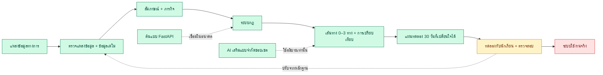

<a id="top"></a>

<p align="center">
  
</p>

# FutureMe AI

<p align="center">
  <strong>ตัวช่วยสำรวจเส้นทางเรียนและอาชีพสำหรับนักเรียนไทย</strong><br>
  ทบทวน → ทดลอง → เปรียบเทียบ → ลงมือทำ
</p>

<p align="center">
  <a href="README.md">EN</a>
  &nbsp;·&nbsp;
  <a href="READMETH.md"><strong>TH</strong></a>
  &nbsp;·&nbsp;
  <a href="#การทำงานของโครงการ">การทำงาน</a>
  &nbsp;·&nbsp;
  <a href="#สถานะปัจจุบัน">สถานะปัจจุบัน</a>
  &nbsp;·&nbsp;
  <a href="#การรันในเครื่อง">การรันในเครื่อง</a>
  &nbsp;·&nbsp;
  <a href="#คำถามที่พบบ่อย">คำถามที่พบบ่อย</a>
</p>

---

## ภาพรวม

FutureMe เป็นต้นแบบเครื่องมือช่วยตัดสินใจสำหรับนักเรียนมัธยมต้น มัธยมปลาย และอาชีวศึกษา
ระบบนำความสนใจ ภารกิจจำลอง และข้อจำกัดของผู้เรียนมาประกอบกัน ก่อนเสนอหลายเส้นทางให้เปรียบเทียบ
พร้อมแผนทดลองลงมือทำ 30 วัน โดยไม่ฟันธงว่าอาชีพใดคือคำตอบเดียวที่ถูกต้อง

| คำถาม | คำตอบ |
|---|---|
| **เหมาะกับใคร?** | นักเรียนไทยที่กำลังสำรวจเส้นทางเรียนหรืออาชีพ |
| **ได้ผลลัพธ์อะไร?** | สมมติฐานเส้นทาง 0–3 ทาง พร้อมเหตุผล ข้อจำกัด การเปรียบเทียบ และแผน 30 วัน |
| **AI ตัดสินผลหรือไม่?** | ไม่ ระบบกฎเป็นผู้เลือกเส้นทาง ส่วน AI ใช้อธิบายเพิ่มเติมเท่านั้น |
| **พร้อมใช้จริงหรือยัง?** | ยัง ระบบเป็นต้นแบบสำหรับแฮกกาธอนที่รันและทดสอบได้ แต่ยังต้องตรวจข้อมูลและทดลองกับนักเรียนจริง |

### ตัวอย่างเว็บแอปล่าสุด

ภาพถ่ายจาก production build ที่รันจริงของ repository นี้เมื่อวันที่ 9 สิงหาคม 2569

<table>
  <tr>
    <th>หน้าเริ่มต้น</th>
    <th>สัมภาษณ์ความสนใจ</th>
  </tr>
  <tr>
    <td><a href="03_WebApp/Pre_Present/assets/screenshots/app/landing-2026-08-09.png"></a></td>
    <td><a href="03_WebApp/Pre_Present/assets/screenshots/app/interview-2026-08-09.png"></a></td>
  </tr>
  <tr>
    <th>เส้นทางที่แนะนำ</th>
    <th>แผนทดลอง 30 วัน</th>
  </tr>
  <tr>
    <td><a href="03_WebApp/Pre_Present/assets/screenshots/app/routes-2026-08-09.png"></a></td>
    <td><a href="03_WebApp/Pre_Present/assets/screenshots/app/plan-2026-08-09.png"></a></td>
  </tr>
</table>

---

## การทำงานของโครงการ

### เวิร์กโฟลว์ทั้งหมด



ต้นแบบครบเส้นทางรันได้แล้ว (สีเขียว) ขั้นต่อไปคือทดลองกับนักเรียนจริง (สีเหลือง)
ส่วนบัญชี ฐานข้อมูลถาวร และระบบ production ยังเป็นแผน (สีแดง)

### ขั้นตอนของผู้เรียน

| ขั้น | สิ่งที่เกิดขึ้น |
|---|---|
| **1. ทบทวน** | ตอบคำถามความสนใจตามโครงสร้าง RIASEC 30 ข้อ คำถามบริบทที่จำเป็น 4 ข้อ และคำถามปลายเปิด 1 ข้อ |
| **2. ทดลอง** | ทำภารกิจจำลองสั้น ๆ หนึ่งในสามภารกิจ |
| **3. สำรวจ** | ระบบกฎตรวจหลักฐานและเสนอเส้นทาง 0–3 ทาง |
| **4. เปรียบเทียบ** | เปรียบเทียบทุกเส้นทางด้วยเกณฑ์เดียวกัน 5 ด้าน |
| **5. ลงมือทำ** | เลือกหนึ่งเส้นทางไปทดลองผ่านแผน 30 วันที่เปลี่ยนใจได้ |

### หลักการคำนวณคำแนะนำ

น้ำหนักที่ใช้ในต้นแบบปัจจุบันคือ

`ความสนใจ 30% · ความเป็นไปได้ 25% · หลักฐานจากภารกิจ 20% · รูปแบบการเรียนรู้ 15% · ความยืดหยุ่น 10%`

ระบบปฏิเสธการสรุปเมื่อข้อมูลไม่พอ แสดงผลเสมอ และชี้ความขัดแย้งของคำตอบได้
น้ำหนักเหล่านี้เป็นกฎของผลิตภัณฑ์ ไม่ใช่ผลการวัดทางจิตวิทยาที่ผ่านการรับรอง

### AI ความเป็นส่วนตัว และการไหลของข้อมูล

- ข้อมูลแบบประเมิน ภารกิจ เส้นทาง และแผนเก็บในเบราว์เซอร์เป็นค่าเริ่มต้น
- การเลือกเส้นทางทำงานได้โดยไม่ต้องมีบัญชี ฐานข้อมูล แบ็กเอนด์ หรือ API key
- AI เสริมใช้เรียบเรียงคำอธิบายหรือตอบคำถามในขอบเขต repository แต่เปลี่ยนเส้นทางไม่ได้
- ห้ามเปิดใช้คีย์แบบมีค่าใช้จ่ายบนระบบสาธารณะก่อนมีการยืนยันตัวตน จำกัดคำขอ จำกัดงบ และตรวจนโยบายเก็บข้อมูล

---

## สถาปัตยกรรม

| ส่วนประกอบ | หน้าที่ | สถานะ |
|---|---|---|
| **เว็บแอป Next.js** | เส้นทางผู้เรียน session ในเครื่อง ระบบตัดสินใจ การเปรียบเทียบ แผน และแชต | ✅ รันได้ |
| **ข้อมูลเริ่มต้น** | คำถาม 30 ข้อ ภารกิจ 3 แบบ และเส้นทางตัวอย่าง 6 ทาง | 🟡 ข้อมูลเดโม |
| **ชั้นงานวิจัย** | ตรวจแหล่งข้อมูล หลักสูตร ตลาดแรงงาน สถานะข้อกล่าวอ้าง และงานวิจัยด้านเทคนิค | 🟡 ตรวจรอบแรกแล้ว |
| **แบ็กเอนด์ FastAPI** | ต้นแบบ API ภารกิจและเส้นทาง พร้อมที่เก็บข้อมูลในหน่วยความจำ | 🟡 ต้นแบบแยก |
| **AI เสริม** | แชตแบบจำกัดขอบเขตและเรียบเรียงคำอธิบาย | 🟡 ไม่บังคับ |
| **บริการระดับใช้งานจริง** | บัญชี ฐานข้อมูลถาวร RAG เครื่องมือโรงเรียน และระบบคลาวด์ | 🔴 ยังเป็นแผน |

เว็บปัจจุบันคือแหล่งอ้างอิงหลักของผลิตภัณฑ์ แบ็กเอนด์ FastAPI ยังไม่เชื่อมกับเส้นทางเดโมหลัก
ไฟล์แบ็กเอนด์บางส่วนยังใช้ชื่อเดิมว่า **FuturePath AI** ส่วนชื่อผลิตภัณฑ์ปัจจุบันคือ **FutureMe AI**

---

## สถานะปัจจุบัน

### ✅ ทำงานได้แล้ว

- เส้นทางผู้ใช้ตั้งแต่แบบประเมินถึงแผน 30 วัน
- อินเทอร์เฟซภาษาไทยและอังกฤษ รองรับหลายขนาดหน้าจอและธีมสว่าง มืด หรือตามระบบ
- ระบบกฎ การปฏิเสธเมื่อข้อมูลไม่พอ ผลเสมอ แหล่งที่มา และคำเตือนความเก่า
- การบันทึกในเครื่อง การลบข้อมูล การส่งออกเพื่อวิจัย และสคริปต์วิเคราะห์
- มาสคอตพร้อมระบบสำรองแบบออฟไลน์สำหรับแชตและคำอธิบายเสริม
- การตรวจ mascot sync, typecheck, lint, tests 400 รายการ, production build และ Playwright 64 เส้นทางผ่านทั้งหมด

### 🟡 ต้องตรวจสอบต่อ

- ชุดคำถามและฉบับภาษาไทยยังไม่ผ่านการตรวจสอบกับนักเรียนจริง
- ค่าใช้จ่าย การย้ายที่อยู่ ระยะเวลาก่อนมีรายได้ ความยืดหยุ่น จุดแข็ง และข้อจำกัดบางส่วนเป็นค่าประมาณของทีม
- ข้อมูลเส้นทางลงวันที่ `2026-01-15` และเกินรอบทบทวน 180 วันแล้ว
- งานวิจัยผ่านการตรวจแหล่งรอบแรก ไม่ใช่การรับรองว่าข้อมูลจะถูกต้องถาวร
- การตรวจ integration อัตโนมัติผ่านแล้ว แต่ยังต้องทบทวนแหล่งข้อมูลและทดลองกับนักเรียนจริง

### 🔴 ยังไม่ได้ทำ

- บัญชีจริง ที่เก็บข้อมูลถาวร และการยืนยันตัวตนระดับใช้งานจริง
- แดชบอร์ดผู้ปกครองและครูแนะแนว
- การเชื่อมโรงเรียน TCAS, NDLP/DEEP หรือ AIS API แบบใช้งานจริง
- RAG และระบบคลาวด์ระดับใช้งานจริง การรับรองจริยธรรม และการทดลองกับนักเรียนจริง

---

## การรันในเครื่อง

ต้องใช้ Node.js 20 ขึ้นไป

```bash
cd 03_WebApp/Pre_Present
npm ci
npm run dev
```

เปิด [http://localhost:3000](http://localhost:3000) แล้วเลือก **Start as guest**

---

## คำถามที่พบบ่อย

<details>
<summary><strong>ใช้เดโมโดยไม่มี AI หรือแบ็กเอนได้ไหม?</strong></summary>

ได้ เส้นทางผู้เรียนทั้งหมดทำงานในเบราว์เซอร์โดยไม่ต้องใช้ทั้งสองส่วน
</details>

<details>
<summary><strong>FutureMe รับประกันการสอบติดหรือได้งานไหม?</strong></summary>

ไม่ เส้นทางเป็นสมมติฐานสำหรับทดลองสำรวจ ไม่ใช่คำทำนายหรือการรับประกัน
</details>

<details>
<summary><strong>นี่คือแบบทดสอบ RIASEC ที่ผ่านการรับรองหรือไม่?</strong></summary>

ไม่ ระบบใช้โครงสร้าง RIASEC เพื่อช่วยทบทวนตนเอง แต่ชุดคำถามและฉบับภาษาไทยยังต้องผ่านการตรวจสอบ
</details>

<details>
<summary><strong>ข้อมูลผู้เรียนเก็บที่ไหน?</strong></summary>

ความคืบหน้าแบบประเมินเก็บในเบราว์เซอร์เป็นค่าเริ่มต้น ส่วนข้อความแชตใช้เส้นทางเครือข่ายแยก
เฉพาะเมื่อผู้เรียนกดส่ง
</details>

<details>
<summary><strong>นักพัฒนาควรแก้ส่วนใดก่อน?</strong></summary>

ใช้ `03_WebApp/Pre_Present/` สำหรับงานผลิตภัณฑ์ปัจจุบัน และอัปเดตข้อมูลเส้นทางก่อนทำ pilot
</details>

<details>
<summary><strong>ภาพใน README มาจากไหน?</strong></summary>

ภาพถ่ายโดยตรงจาก production build ใน `03_WebApp/Pre_Present/` หลังทดลองเส้นทางผู้เยี่ยมชมจริง
ในเว็บที่กำลังทำงาน
</details>

<details>
<summary><strong>เอกสารหลักอยู่ที่ไหน?</strong></summary>

[README เว็บภาษาไทย](03_WebApp/Pre_Present/READMETH.md) ·
[สถาปัตยกรรม](03_WebApp/Pre_Present/docs/05-system-architecture.md) ·
[การตรวจแหล่งข้อมูล](03_WebApp/Pre_Present/docs/09-source-review.md) ·
[คู่มืองานวิจัย](01_Research/Data/README.md) ·
[ไฟล์นำเสนอ PDF](Presentation/FutureMe_Project_Presentation.pdf)
</details>

---

FutureMe เป็นต้นแบบที่นักศึกษาพัฒนาสำหรับ JUMP THAILAND Hackathon 2026 ระบบไม่สามารถทำนาย
การสอบติด การได้งาน รายได้ หรือความเสี่ยงด้านสุขภาพจิต และไม่ควรใช้แทนข้อมูลทางการล่าสุด
หรือคำแนะนำจากมนุษย์

<p align="center"><a href="#top">กลับขึ้นด้านบน</a></p>
