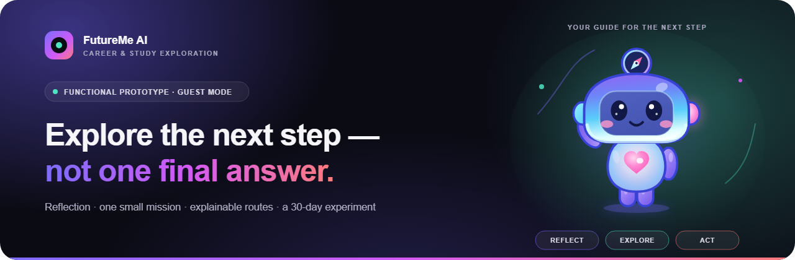
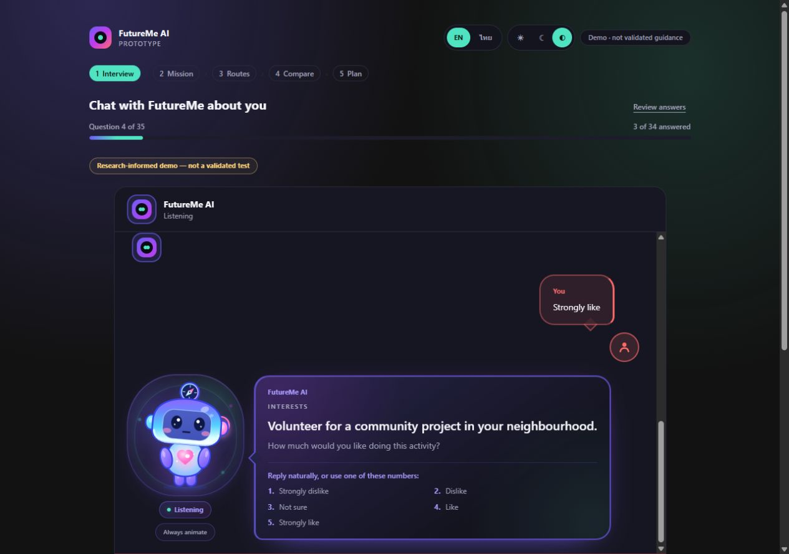
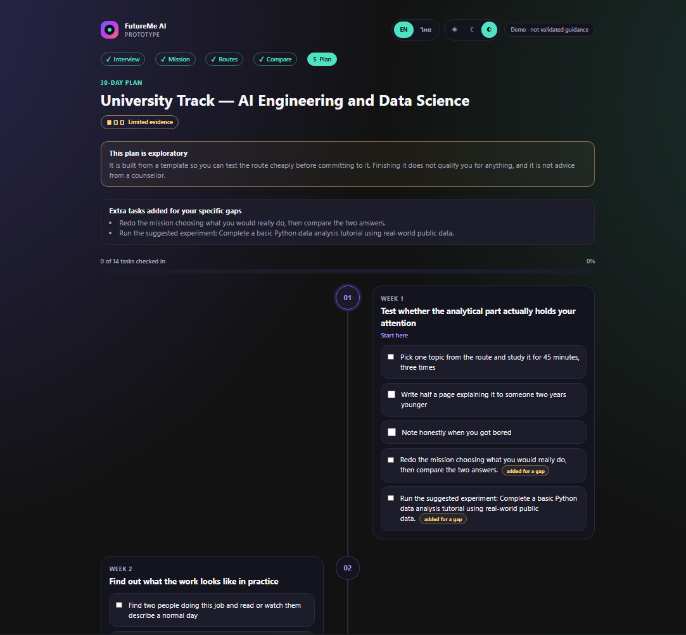
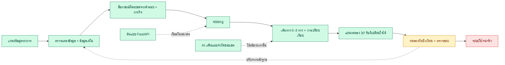

<a id="top"></a>

**README:** [EN](README.md) · **[TH](READMETH.md)**

<p align="center">
  
</p>

# FutureMe AI

<p align="center">
  <strong>ตัวช่วยสำรวจเส้นทางเรียนและอาชีพสำหรับนักเรียนไทย</strong><br>
  ทบทวน → ทดลอง → เปรียบเทียบ → ลงมือทำ
</p>

<p align="center">
  <a href="#การทำงานของโครงการ">การทำงาน</a>
  &nbsp;·&nbsp;
  <a href="#สถานะปัจจุบัน">สถานะปัจจุบัน</a>
  &nbsp;·&nbsp;
  <a href="#repository-guide">โครงสร้างไฟล์</a>
  &nbsp;·&nbsp;
  <a href="#การรันในเครื่อง">การรันในเครื่อง</a>
  &nbsp;·&nbsp;
  <a href="Presentation/FutureMe_Project_Presentation.pdf">ไฟล์นำเสนอ</a>
  &nbsp;·&nbsp;
  <a href="#คำถามที่พบบ่อย">คำถามที่พบบ่อย</a>
</p>

<p align="center"><sub>ตรวจทานเอกสาร สัญญาขอบเขตข้อมูล และไฟล์นำเสนอล่าสุดเมื่อ 11 สิงหาคม 2026</sub></p>

---

## ภาพรวม

FutureMe เป็นต้นแบบเครื่องมือช่วยตัดสินใจสำหรับนักเรียนมัธยมต้น มัธยมปลาย และอาชีวศึกษา
ระบบประกอบด้วยการทบทวนความสนใจ 30 ข้อ โดยคำตอบแรกกำหนดคำถามต่อยอด 2 ข้อ ภารกิจจำลองสั้น ๆ การเปรียบเทียบสมมติฐานเส้นทางเรียนหรืออาชีพได้สูงสุด 3 ทางแบบอธิบายเหตุผลได้ การค้นหาสถานศึกษาใกล้เคียงตามจังหวัด และแผนทดลอง 30 วันที่เปลี่ยนใจได้
ระบบไม่ฟันธง “อาชีพที่ใช่ที่สุด” ไม่รับประกันการสอบติด และไม่ยืนยันว่าสถานศึกษาที่แสดงเปิดสอนหลักสูตรใดหลักสูตรหนึ่ง

| คำถาม | คำตอบ |
|---|---|
| **เหมาะกับใคร?** | นักเรียนไทยที่กำลังสำรวจเส้นทางเรียนหรืออาชีพ |
| **ได้ผลลัพธ์อะไร?** | สมมติฐานเส้นทาง 0–3 ทาง พร้อมเหตุผล ข้อจำกัด การเปรียบเทียบ ข้อมูลสถานศึกษาใกล้เคียง และแผน 30 วัน |
| **เดโมนี้ใช้อะไรบ้าง?** | คำถามความสนใจที่ใช้จริง 30 ข้อพร้อมการจัดคำถามต่อยอดตามกฎ ภารกิจ 3 แบบ เส้นทางตัวอย่าง 12 ทาง และรายการสถานศึกษาใกล้เคียง 1,961 รายการ ครบทั้ง 77 จังหวัด |
| **AI ตัดสินผลหรือไม่?** | ไม่ ระบบกฎเป็นผู้เลือกเส้นทาง ส่วน AI ใช้อธิบายเพิ่มเติมหรือตอบคำถามเกี่ยวกับ repository ภายในขอบเขตที่กำหนดเท่านั้น |
| **พร้อมใช้จริงหรือยัง?** | ยัง ระบบเป็นต้นแบบสำหรับแฮกกาธอนที่รันและทดสอบได้ แต่ยังต้องตรวจข้อมูลและทดลองกับนักเรียนจริง |

### ตัวอย่างเว็บแอปล่าสุด

ภาพถ่ายจาก production build ที่รันจริงของ repository นี้เมื่อวันที่ 9 สิงหาคม 2569 ครอบคลุมเส้นทางผู้เรียนที่รวมอยู่ในระบบปัจจุบัน โดยซอร์สโค้ดและการทดสอบอัตโนมัติเป็นหลักฐานอ้างอิงการทำงาน

<table>
  <tr>
    <th>หน้าเริ่มต้น</th>
    <th>สัมภาษณ์ความสนใจ</th>
  </tr>
  <tr>
    <td><a href="03_WebApp/assets/screenshots/app/landing-2026-08-09.png"></a></td>
    <td><a href="03_WebApp/assets/screenshots/app/interview-2026-08-09.png"></a></td>
  </tr>
  <tr>
    <th>เส้นทางที่แนะนำ</th>
    <th>แผนทดลอง 30 วัน</th>
  </tr>
  <tr>
    <td><a href="03_WebApp/assets/screenshots/app/routes-2026-08-09.png"></a></td>
    <td><a href="03_WebApp/assets/screenshots/app/plan-2026-08-09.png"></a></td>
  </tr>
</table>

---

## การทำงานของโครงการ

### เวิร์กโฟลว์ทั้งหมด



ต้นแบบครบเส้นทางรันได้แล้ว (สีเขียว) ขั้นต่อไปคือทดลองกับนักเรียนจริง (สีเหลือง)
ส่วนบัญชี ฐานข้อมูลถาวร และระบบ production ยังเป็นแผน (สีแดง)

### ขั้นตอนของผู้เรียน

| ขั้น | สิ่งที่เกิดขึ้น |
|---|---|
| **1. ทบทวน** | ตอบคำถามความสนใจตามโครงสร้าง RIASEC 30 ข้อ โดยคำตอบแรกเลือกคำถามต่อยอดทันที 2 ข้อ จากนั้นตอบคำถามบริบทที่จำเป็น 4 ข้อและคำถามปลายเปิด 1 ข้อ |
| **2. ทดลอง** | ทำภารกิจจำลองสั้น ๆ หนึ่งในสามภารกิจ |
| **3. สำรวจ** | ระบบกฎตรวจหลักฐานและเสนอเส้นทาง 0–3 ทาง |
| **4. เปรียบเทียบ** | เปรียบเทียบทุกเส้นทางด้วยเกณฑ์ให้คะแนน 3 ด้าน และแยกค่าประมาณเชิงปฏิบัติออกอย่างชัดเจน |
| **5. ลงมือทำ** | เลือกหนึ่งเส้นทางไปทดลองผ่านแผน 30 วันที่เปลี่ยนใจได้ |

### หลักการคำนวณคำแนะนำ

น้ำหนักที่ใช้ในต้นแบบปัจจุบันคือ

`ความสนใจ 50% · หลักฐานจากภารกิจ 30% · ความสอดคล้องกับสภาพแวดล้อมการเรียนรู้ 20%`

องค์ประกอบสุดท้ายเป็นการประมาณที่ทีมกำหนดขึ้น โดยนำโปรไฟล์จากการสัมภาษณ์ชุดเดิมมาเทียบกับ
สภาพแวดล้อมการเรียนรู้ของแต่ละเส้นทาง ไม่ใช่แบบทดสอบ “สไตล์การเรียนรู้” และไม่ใช่หลักฐานอิสระ

ระบบปฏิเสธการสรุปเมื่อข้อมูลไม่พอ แสดงเส้นทางที่มีคะแนนสูสีกันโดยไม่จัดอันดับเท็จ และชี้ความขัดแย้งของคำตอบได้
น้ำหนักเหล่านี้เป็นกฎของผลิตภัณฑ์ ไม่ใช่ผลการวัดทางจิตวิทยาที่ผ่านการรับรอง

ค่าใช้จ่าย การย้ายที่อยู่ ระยะเวลาก่อนมีรายได้ และความยืดหยุ่นเป็นข้อมูลสำหรับชวนตรวจสอบที่ยังไม่มีแหล่งยืนยัน ระบบแสดงข้อมูลเหล่านี้ไว้ประกอบการพิจารณา แต่ไม่ใช้ให้คะแนน จัดลำดับ หรือตัดเส้นทางออก

### AI ความเป็นส่วนตัว และการไหลของข้อมูล

- ข้อมูลแบบประเมิน ภารกิจ เส้นทาง และแผนเก็บในเบราว์เซอร์เป็นค่าเริ่มต้น
- การเลือกเส้นทางทำงานได้โดยไม่ต้องมีบัญชี ฐานข้อมูล แบ็กเอนด์ หรือ API key
- AI เสริมใช้เรียบเรียงคำอธิบายหรือตอบคำถามในขอบเขต repository แต่เปลี่ยนเส้นทางไม่ได้
- ห้ามเปิดใช้คีย์แบบมีค่าใช้จ่ายบนระบบสาธารณะก่อนมีการยืนยันตัวตน จำกัดคำขอ จำกัดงบ และตรวจนโยบายเก็บข้อมูล

---

## สถาปัตยกรรม

| ส่วนประกอบ | หน้าที่ | สถานะ |
|---|---|---|
| **เว็บแอป Next.js** | เส้นทางผู้เรียน session ในเครื่อง ระบบตัดสินใจ การเปรียบเทียบ แผน และแชต | ✅ รันได้ |
| **ข้อมูลเดโม** | คำถามความสนใจที่ใช้จริง 30 ข้อ ภารกิจ 3 แบบ เส้นทางตัวอย่าง 12 ทาง และข้อมูลสถานศึกษาใกล้เคียง 1,961 รายการ ครบ 77 จังหวัด | 🟡 ข้อมูลต้นแบบที่มีฐานงานวิจัย |
| **ชั้นงานวิจัย** | ตรวจแหล่งข้อมูล หลักสูตร ตลาดแรงงาน สถานะข้อกล่าวอ้าง และงานวิจัยด้านเทคนิค | 🟡 ตรวจรอบแรกแล้ว |
| **ทะเบียนขอบเขตข้อมูลการศึกษา** | ขอบเขต Institution / Program / Admission / Financial / Location แหล่งที่มา วันที่ ช่องว่าง และขอบเขตการใช้ตัดสินใจ | ✅ ตรวจด้วยระบบอัตโนมัติ |
| **แบ็กเอนด์ FastAPI** | ต้นแบบ API ภารกิจและเส้นทาง พร้อมที่เก็บข้อมูลในหน่วยความจำ | 🟡 ต้นแบบแยก |
| **AI เสริม** | แชตแบบจำกัดขอบเขตและเรียบเรียงคำอธิบาย | 🟡 ไม่บังคับ |
| **บริการระดับใช้งานจริง** | บัญชี ฐานข้อมูลถาวร RAG เครื่องมือโรงเรียน และระบบคลาวด์ | 🔴 ยังเป็นแผน |

เว็บปัจจุบันคือแหล่งอ้างอิงหลักของผลิตภัณฑ์ แบ็กเอนด์ FastAPI ยังไม่เชื่อมกับเส้นทางเดโมหลัก
ชื่อ schema และ class บางส่วนยังคงใช้คำว่า `FuturePath` เพื่อไม่ให้ import เดิมเสียหาย
ส่วนชื่อผลิตภัณฑ์ปัจจุบันคือ **FutureMe AI**

---

## สถานะปัจจุบัน

### ✅ ทำงานได้แล้ว

- เส้นทางผู้ใช้ตั้งแต่แบบประเมินถึงแผน 30 วัน
- คำถามต่อยอดแบบ deterministic จากคำตอบแรก โดยเปลี่ยนเฉพาะลำดับคำถาม 2 ข้อ ไม่เปลี่ยนคลัง 30 ข้อหรือสูตรคะแนน
- อินเทอร์เฟซภาษาไทยและอังกฤษ รองรับหลายขนาดหน้าจอและธีมสว่าง มืด หรือตามระบบ
- ระบบกฎ การปฏิเสธเมื่อข้อมูลไม่พอ ผลเสมอ แหล่งที่มา และคำเตือนความเก่า
- การบันทึกในเครื่อง การลบข้อมูล การส่งออกเพื่อวิจัย และสคริปต์วิเคราะห์
- มาสคอตเปิดแอนิเมชันเป็นค่าเริ่มต้นตลอดเส้นทาง พร้อมตัวเลือกให้กลับไปใช้การตั้งค่าการเคลื่อนไหวของระบบ
- ขอบเขตข้อมูลตรวจด้วยระบบอัตโนมัติ: สถานศึกษาต้นทาง 1,417 ระเบียน แสดงสถานศึกษาที่ไม่ซ้ำ 1,375 แห่ง มี 140 แห่งที่จับคู่เส้นทางจากข้อมูลหลักสูตร และยังไม่มีระเบียน admission หรือการเงินที่ตรวจสอบแล้วในระบบ
- มีการตรวจ mascot sync, typecheck, lint, unit/integration tests, production build และ browser journeys ใน repository
- ผลตรวจล่าสุด 11 สิงหาคม 2026: Vitest 27 ไฟล์ รวม 533 tests และ Playwright ผ่านครบทั้ง 95 เส้นทาง
  พร้อมผ่านการตรวจข้อมูลและ production build ส่วน backend scaffold ที่แยกจากเว็บผ่าน contract tests
  18 รายการและตัวตรวจขอบเขตความปลอดภัย

### 🟡 ต้องตรวจสอบต่อ

- ชุดคำถามและฉบับภาษาไทยยังไม่ผ่านการตรวจสอบกับนักเรียนจริง
- คลังคำถาม 1,000 ข้อที่กู้คืนผ่านการตรวจโครงสร้างแล้ว แต่ยังไม่ใช้ในระบบจริง เนื้อหา ความเป็นธรรม การให้คะแนน และกฎแตกสาขายังต้องให้ผู้เชี่ยวชาญและนักเรียนตรวจสอบ
- กฎเลือกคำถามต่อยอด 2 ข้อเป็นฮิวริสติกของผลิตภัณฑ์ ไม่ใช่ CAT, IRT หรือหลักฐานว่าแบบประเมินแม่นยำขึ้น
- ค่าใช้จ่าย การย้ายที่อยู่ ระยะเวลาก่อนมีรายได้ ความยืดหยุ่น จุดแข็ง และข้อจำกัดบางส่วนเป็นค่าประมาณของทีม โดย 4 รายการแรกไม่ถูกใช้ตัดสินเส้นทาง
- ทะเบียนสถานศึกษายังคงแสดงพิกัดที่หายไปหรือถูกกักกัน 207 รายการ และเว็บไซต์ที่หายไป 987 รายการเป็น “ไม่ทราบ” โดยไม่สร้างข้อมูลขึ้นเอง
- ข้อมูลเส้นทางและหลักสูตรต้องทบทวนแหล่งที่มาอย่างต่อเนื่อง โดยบันทึกวันที่ตรวจสอบ checksum แบบเต็ม และผลตรวจความสมบูรณ์อัตโนมัติไว้กับข้อมูลภูมิศาสตร์
- เกณฑ์ TCAS รายหลักสูตร ค่าเล่าเรียน ทุนการศึกษา ที่พัก และค่าครองชีพยังไม่มีระเบียนที่ตรวจสอบแล้วในระบบ จึงแสดงว่าไม่มีข้อมูลแทนการประมาณค่า
- งานวิจัยผ่านการตรวจแหล่งรอบแรก ไม่ใช่การรับรองว่าข้อมูลจะถูกต้องถาวร
- การตรวจ integration อัตโนมัติผ่านแล้ว แต่ยังต้องทบทวนแหล่งข้อมูลและทดลองกับนักเรียนจริง

### 🔴 ยังไม่ได้ทำ

- บัญชีจริง ที่เก็บข้อมูลถาวร และการยืนยันตัวตนระดับใช้งานจริง
- แดชบอร์ดผู้ปกครองและครูแนะแนว
- การเชื่อมโรงเรียน TCAS, NDLP/DEEP หรือ AIS API แบบใช้งานจริง
- RAG และระบบคลาวด์ระดับใช้งานจริง การรับรองจริยธรรม และการทดลองกับนักเรียนจริง

---

<a id="repository-guide"></a>

## โครงสร้าง repository

ใน branch นี้เหลือเฉพาะผลิตภัณฑ์ หลักฐาน และไฟล์ที่สร้างซ้ำได้ซึ่งยังใช้งานอยู่

| ตำแหน่ง | หน้าที่ |
|---|---|
| [`01_Research/`](01_Research/) | หลักฐานที่ตรวจสอบแล้ว งานวิจัยแบบสอบถาม และ pipeline ข้อมูลภูมิศาสตร์ |
| [`02_Backend/`](02_Backend/) | โครงสถาปัตยกรรม FastAPI ที่ยังไม่เชื่อมกับเว็บ และชุดทดสอบ |
| [`03_WebApp/`](03_WebApp/) | ผลิตภัณฑ์ FutureMe ปัจจุบันและชุดทดสอบอัตโนมัติ |
| [`04_Design/FutureMe_Mascot_Lab/`](04_Design/FutureMe_Mascot_Lab/) | ต้นทางมาสคอตที่ซิงก์เข้าเว็บแอป |
| [`Presentation/`](Presentation/) | สไลด์ฉบับปัจจุบัน PDF ที่ตรงกัน บันทึกแหล่งข้อมูล และผลตรวจ QA |

branch นี้ไม่นำ snapshot เก่า แนวทางออกแบบที่เลิกใช้ ไฟล์ render ที่สร้างใหม่ได้ สื่อส่วนตัว
และบันทึกการทำงานของ agent มาปะปน ไฟล์ที่ลบยังเรียกคืนได้จากประวัติ Git

---

## การรันในเครื่อง

ต้องใช้ Node.js 20 ขึ้นไป

```bash
cd 03_WebApp
npm ci
npm run dev
```

เปิด [http://localhost:3000](http://localhost:3000) แล้วเลือก **Start as guest**

---

## คำถามที่พบบ่อย

<details>
<summary><strong>ใช้เดโมโดยไม่มี AI หรือแบ็กเอนได้ไหม?</strong></summary>

ได้ เส้นทางผู้เรียนทั้งหมดทำงานในเบราว์เซอร์โดยไม่ต้องใช้ทั้งสองส่วน
</details>

<details>
<summary><strong>FutureMe รับประกันการสอบติดหรือได้งานไหม?</strong></summary>

ไม่ เส้นทางเป็นสมมติฐานสำหรับทดลองสำรวจ ไม่ใช่คำทำนายหรือการรับประกัน
</details>

<details>
<summary><strong>ระบบแนะนำมหาวิทยาลัยโดยใช้ TCAS ค่าเล่าเรียน ทุน หรือระยะทางหรือไม่?</strong></summary>

ไม่ เอนจินเส้นทางไม่ได้เลือกสถานศึกษา หน้าสถานศึกษาใกล้เคียงเป็น directory ที่เรียงตามระยะทาง
จากศูนย์กลางจังหวัดเท่านั้น จากสถานศึกษาที่แสดง 1,375 แห่ง มีเพียง 140 แห่งที่มีการจับคู่เส้นทาง
จากข้อมูลหลักสูตรบางส่วน และยังไม่มีข้อมูล TCAS รายหลักสูตร ค่าเล่าเรียน ทุน ที่พัก หรือค่าครองชีพ
ที่ตรวจสอบแล้วในระบบ ดู [สัญญาขอบเขตข้อมูล](03_WebApp/docs/data-coverage-and-governance.md)
</details>

<details>
<summary><strong>นี่คือแบบทดสอบ RIASEC ที่ผ่านการรับรองหรือไม่?</strong></summary>

ไม่ ระบบใช้โครงสร้าง RIASEC เพื่อช่วยทบทวนตนเอง แต่ชุดคำถามและฉบับภาษาไทยยังต้องผ่านการตรวจสอบ
</details>

<details>
<summary><strong>แบบสัมภาษณ์ใช้คลังคำถาม 1,000 ข้อที่กู้คืนแล้วหรือไม่?</strong></summary>

ยังไม่ใช้ คลังสองภาษาชุดนี้เก็บไว้สำหรับงานวิจัยระยะถัดไปและมีสคริปต์ตรวจโครงสร้าง
แบบสัมภาษณ์ปัจจุบันยังใช้คำถามที่ทบทวนแล้ว 30 ข้อจาก `questions.json` โดยคำตอบแรกเพียงกำหนดว่า
คำถาม 2 ข้อใดจะแสดงต่อทันที กลไกนี้เป็นการจัดลำดับตามกฎ ไม่ใช่ CAT หรือ IRT
</details>

<details>
<summary><strong>ข้อมูลผู้เรียนเก็บที่ไหน?</strong></summary>

ข้อมูลแบบประเมิน ภารกิจ และแผนเก็บใน `localStorage` ของเบราว์เซอร์ ระบบต้นแบบไม่มีฐานข้อมูลของ
แอปหรือที่เก็บบทสนทนาบนเซิร์ฟเวอร์ คำขอให้อธิบายผลส่งเฉพาะรหัสเส้นทางและรหัสเหตุผล ส่วนแชตส่ง
บทสนทนาที่จำกัดขนาดเมื่อผู้เรียนกดส่ง และอาจส่งต่อถึงผู้ให้บริการที่ตั้งค่าไว้ อย่างไรก็ตาม
ผู้ให้บริการโฮสต์อาจเก็บบันทึกคำขอได้
</details>

<details>
<summary><strong>สถาปัตยกรรมส่วนใดทำงานแล้ว และส่วนใดยังเป็นข้อเสนอ?</strong></summary>

ระบบที่ทำงานแล้วคือเว็บสำหรับผู้เยี่ยมชมที่พัฒนาด้วย Next.js และ TypeScript ใช้เอนจินตัดสินใจ
ฝั่งเบราว์เซอร์และเก็บข้อมูลในเบราว์เซอร์ ส่วน FastAPI, PostgreSQL, Qdrant, BGE-M3, Kubernetes,
AIS Cloud, ระบบยืนยันตัวตน และการเชื่อมต่อโรงเรียนยังเป็นแบบออกแบบสำหรับระบบจริง ไม่ใช่ส่วนที่
กำลังทำงาน ดูรายละเอียดใน [ขอบเขตสถาปัตยกรรม](03_WebApp/docs/05-system-architecture.md)
</details>

<details>
<summary><strong>ตรวจสอบและทำซ้ำผลคำแนะนำได้หรือไม่?</strong></summary>

ได้ เมื่อใช้ข้อมูลนำเข้าและแค็ตตาล็อกชุดเดียวกัน ระบบจะให้เส้นทางเดิม เนื่องจากการให้คะแนน
ตัวกรอง การจัดการคะแนนเท่ากัน และเงื่อนไขปฏิเสธคำแนะนำเป็น TypeScript แบบ deterministic
หน้าจอแสดงเวอร์ชันเอนจิน วันที่ของแค็ตตาล็อก เหตุผล ข้อมูลที่ยังไม่ทราบ และแหล่งที่มา
อย่างไรก็ตาม ค่าน้ำหนักเป็นดุลยพินิจในการออกแบบ ไม่ได้ฝึกจากข้อมูลผลลัพธ์ และการทดสอบอัตโนมัติ
ตรวจเฉพาะการทำงานตามที่กำหนดไว้ในโค้ด ไม่ได้ยืนยันความถูกต้องในการใช้งานจริง
</details>

<details>
<summary><strong>ระบบจัดการที่มาและความใหม่ของข้อมูลเส้นทางอย่างไร?</strong></summary>

แค็ตตาล็อกตัวอย่างระบุสถานะแหล่งข้อมูล URL และวันที่ตรวจล่าสุดของแต่ละเส้นทาง พร้อมวันที่
`dataAsOf` และเกณฑ์ความใหม่ 180 วัน ระบบแจ้งเตือนเมื่อข้อมูลเก่าและระบุช่องข้อมูลที่ไม่มี
แหล่งอ้างอิง ค่าใช้จ่าย การย้ายที่อยู่ ระยะเวลาก่อนมีรายได้ และความยืดหยุ่นไม่ถูกใช้ตัดสินเส้นทาง
ส่วนจุดแข็งและข้อจำกัดยังเป็นข้อความประกอบตัวอย่าง ทะเบียนภูมิศาสตร์เก็บ checksum แบบเต็ม และ
`npm run check:data` ใช้ตรวจความสอดคล้องข้ามไฟล์ ดูรายละเอียดใน
[การตรวจแหล่งข้อมูล](03_WebApp/docs/09-source-review.md) และ
[ขอบเขตข้อมูล](03_WebApp/docs/data-coverage-and-governance.md)
</details>

<details>
<summary><strong>ต้องมีหลักฐานใดเพิ่มเติมก่อนทดลองกับนักเรียนจริง?</strong></summary>

โครงการต้องได้รับการรับรองจริยธรรม ความยินยอมจากผู้ปกครองและความยินยอมของนักเรียน ปรับแบบประเมิน
ภาษาไทยอย่างเป็นระบบ สัมภาษณ์ความเข้าใจ ทดลองกับกลุ่มตัวอย่างที่เหมาะสม วิเคราะห์ความเที่ยงและ
โครงสร้าง ตรวจความเท่าเทียมระหว่างกลุ่ม และใช้ข้อมูลเส้นทางปัจจุบันที่มีสิทธิ์ใช้งาน จากนั้นจึง
ปรับค่าน้ำหนักด้วยผลการสำรวจเส้นทางที่สังเกตได้ ดูรายละเอียดใน
[แผนการตรวจสอบ](03_WebApp/docs/validation-plan.md)
</details>

<details>
<summary><strong>ควรวัดความสำเร็จของผลิตภัณฑ์อย่างไร?</strong></summary>

ควรวัดหลักฐานว่าผู้เรียนตัดสินใจได้ดีขึ้น ไม่ใช่ค่าความมั่นใจของโมเดลหรือจำนวนคลิก ตัวชี้วัด
ได้แก่ การทำแผนทดลอง 30 วันจนเสร็จ การศึกษาข้อมูลเส้นทางต่อ การเปลี่ยนแปลงของความมั่นใจในการ
ตัดสินใจ การประเมินโดยครูแนะแนว และความสามารถในการอธิบายก้าวถัดไปพร้อมข้อแลกเปลี่ยน การประเมิน
ระยะยาวควรติดตามการเข้าศึกษาหรือความต่อเนื่อง โดยไม่ถือว่าเส้นทางเดียวคือคำตอบที่ถูกต้องสำหรับทุกคน
</details>

<details>
<summary><strong>เอกสารหลักอยู่ที่ไหน?</strong></summary>

[README เว็บภาษาไทย](03_WebApp/READMETH.md) ·
[สถาปัตยกรรม](03_WebApp/docs/05-system-architecture.md) ·
[การตรวจแหล่งข้อมูล](03_WebApp/docs/09-source-review.md) ·
[คู่มืองานวิจัย](01_Research/Data/README.md) ·
[ไฟล์นำเสนอ PDF](Presentation/FutureMe_Project_Presentation.pdf)
</details>

---

FutureMe เป็นต้นแบบที่นักศึกษาพัฒนาสำหรับ JUMP THAILAND Hackathon 2026 ระบบไม่สามารถทำนาย
การสอบติด การได้งาน รายได้ หรือความเสี่ยงด้านสุขภาพจิต และไม่ควรใช้แทนข้อมูลทางการล่าสุด
หรือคำแนะนำจากมนุษย์

<p align="center"><a href="#top">กลับขึ้นด้านบน</a></p>
